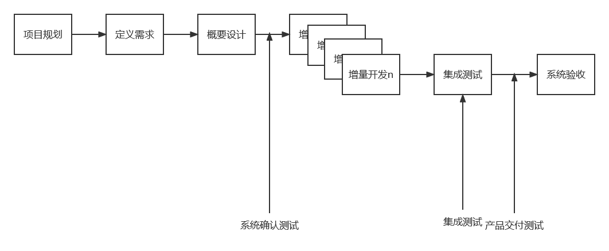

# 网络商城——学信汇软件过程定义  

文件状态：正式发布   
当前版本：v.1.0.0  

作者：   
&emsp;&emsp;姓名：张骞、韩文白、李浩文  
&emsp;&emsp;学号：2019011206、2019011192、2019011162  
&emsp;&emsp;团队：111队  

版本更新信息:  

## 1.引言
### 1.1使用人员
&emsp;&emsp;技术负责人：张骞  
&emsp;&emsp;系统设计人员：宋博文  
&emsp;&emsp;项目管理人员：王羽桐  
&emsp;&emsp;质量保证人员：韩文白 黄绍宸  
&emsp;&emsp;项目开发人员：于培政 何明东 张天翔 李浩文  

### 1.2编写目的
&emsp;&emsp;该文档个是为了用户提供系统开发项目建立一个开发模式和开发过程规范，其主要目的是：  
&emsp;&emsp;1. 定义系统开发生存周期  
&emsp;&emsp;2. 确定生存周期的各个阶段  
&emsp;&emsp;3. 确定能开发基线  
&emsp;&emsp;4. 确定各个阶段相关人员任务  

### 1.3背景
&emsp;&emsp;本项目使用本文档定义的通用过程进行软件的过程管理，它为项目管理人员、开发人员、测试人员等提供了一个完整的过程框架，从而便于项目相关人员在项目目标、交付产品和开发进展方面进行交流沟通。

### 1.4参考资料
+ 《软件项目管理》机械工业出版社  
+ 《软件工程》北京大学出版社  

## 2.软件开发生存期
### 2.1软件开发模型：

采用增量式的开发攻城，在每一个增量过程中需要执行一些活动，具体包括：  
开发活动：需求分析，总体设计，详细设计，实现，测试，评审
支持活动：项目管理，配置管理。  

## 3.阶段定义

### 阶段说明
#### 项目规划：

<table>
<tr>
    <th>参与人员：</th>
    <th>张骞</th>
</tr>
<tr>
    <th>进入条件：</th>
    <td>项目中标并下达任务书</td>
</tr>
<tr>
    <th rowspan="3">输入：</th>
    <td>用户需求</td>
</tr>  
<tr>
    <td>项目投标书</td>
</tr>
<tr>
    <td>用户背景资料</td>
</tr>
<tr>
    <th rowspan="4">活动：</th>
    <td>项目分析评估</td>
</tr>  
<tr>
    <td>系统可行性分析</td>
</tr>
<tr>
    <td>制定项目计划</td>
</tr>
<tr>
    <td>确定项目开发过程、配置计划、质量保证计划</td>
</tr>
<tr>
    <th>输出：</th>
    <td>《项目计划》、《配置计划》、《质量保证计划》、《过程定义》</td>
</tr>
<tr>
    <th>评审：</th>
    <td>有项目经理和团队成员负责评审，并根据评审结果确认现阶段输出</td>
</tr>
</table>

#### 需求定义：

<table>
<tr>
    <th>参与人员：</th>
    <th>宋博文</th>
</tr>
<tr>
    <th>进入条件：</th>
    <td>签订合同</td>
</tr>
<tr>
    <th rowspan="2">输入：</th>
    <td>项目合同</td>
</tr>  
<tr>
    <td>项目计划</td>
</tr>
<tr>
    <th rowspan="3">活动：</th>
    <td>用户需求调研</td>
</tr>  
<tr>
    <td>形成符合规范的需求说明书</td>
</tr>
<tr>
    <td>修改配置计划，质量保证计划</td>
</tr>
<tr>
    <th rowspan="2">输出：</th>
    <td>《需求规格说明书》</td>
</tr>
<tr>
    <td>《配置计划》修改版、《质量保证计划》修改版</td>
</tr>
<tr>
    <th>完成标志：</th>
    <td>完成《需求规格说明书》并通过评审</td>
</tr>
<tr>
    <th>评审：</th>
    <td>有项目经理和团队成员负责评审，并根据评审结果确认现阶段输出</td>
</tr>
</table>

#### 概要设计：

<table>
<tr>
    <th>参与人员：</th>
    <th>宋博文</th>
</tr>
<tr>
    <th>进入条件：</th>
    <td>需求定义完成并通过评审</td>
</tr>
<tr>
    <th rowspan="2">输入：</th>
    <td>《需求规格说明书》</td>
</tr>  
<tr>
    <td>《软件配置表》</td>
</tr>
<tr>
    <th rowspan="2">活动：</th>
    <td>进行系统的概要设计</td>
</tr>
<tr>
    <td>完成系统确认测试</td>
</tr>
<tr>
    <th>输出：</th>
    <td>《系统概要设计》</td>
</tr>
<tr>
    <th>完成标志：</th>
    <td>系统得到确认，完成《系统概要设计》并通过评审</td>
</tr>
<tr>
    <th>评审：</th>
    <td>有项目经理和团队成员负责评审，并根据评审结果确认现阶段输出</td>
</tr>
</table>

#### 增量开发：

<table>
<tr>
    <th>参与人员：</th>
    <th>开发小组成员</th>
</tr>
<tr>
    <th>进入条件：</th>
    <td>系统确认测试通过</td>
</tr>
<tr>
    <th>输入：</th>
    <td>概要设计</td>
</tr>
<tr>
    <th rowspan="6">活动：</th>
    <td>详细调研要开发增量的需求</td>
</tr>
<tr>
    <td>详细设计要开发增量</td>
</tr>
<tr>
    <td>编码</td>
</tr>
<tr>
    <td>单元测试</td>
</tr>
<tr>
    <td>评审测试</td>
</tr>
<tr>
    <td>同样的活动进行下一个增量的开发</td>
</tr>
<tr>
    <th>输出：</th>
    <td>源程序</td>
</tr>
<tr>
    <th>完成标志：</th>
    <td>完成初步编码工作，封装出一个可运行版本</td>
</tr>
<tr>
    <th>评审：</th>
    <td>有项目经理和团队成员负责评审，并根据评审结果确认现阶段输出</td>
</tr>
</table>

#### 集成测试：

<table>
<tr>
    <th>参与人员：</th>
    <th>测试组成员</th>
</tr>
<tr>
    <th>进入条件：</th>
    <td>编码工作基本完成，系统功能基本实现</td>
</tr>
<tr>
    <th>输入：</th>
    <td>测试报告、源程序</td>
</tr>
<tr>
    <th rowspan="5">活动：</th>
    <td>对系统进行集成测设</td>
</tr>
<tr>
    <td>若发现错误</td>
</tr>
<tr>
    <td>发布错误</td>
</tr>
<tr>
    <td>有开发人员修复</td>
</tr>
<tr>
    <td>继续进行测设</td>
</tr>
<tr>
    <th rowspan="3">输出：</th>
    <td>系统错误报告</td>
</tr>
<tr>
    <td>错误修改报告</td>
</tr>
<tr>
    <td>测试通过的源程序</td>
</tr>
<tr>
    <th>完成标志：</th>
    <td>系统集成测试通过</td>
</tr>
<tr>
    <th>评审：</th>
    <td>有项目经理和团队成员负责评审，并根据评审结果确认现阶段输出</td>
</tr>
</table>

#### 系统验收：

<table>
<tr>
    <th>参与人员：</th>
    <th>韩文白 黄绍宸</th>
</tr>
<tr>
    <th>进入条件：</th>
    <td>源程序冻结并通过评审</td>
</tr>
<tr>
    <th>输入：</th>
    <td>冻结的源程序</td>
</tr>
<tr>
    <th rowspan="4">活动：</th>
    <td>提交用户进行系统最终确认</td>
</tr>
<tr>
    <td>完成合同过的的安装、培训等后期工作</td>
</tr>
<tr>
    <td>完成文档并提交用户</td>
</tr>
<tr>
    <td>做项目总结</td>
</tr>
<tr>
    <th>输出：</th>
    <td>产品</td>
</tr>
<tr>
    <th rowspan="2">完成标志：</th>
    <td>用户签收产品</td>
</tr>
<tr>
    <td>完成项目总结</td>
</tr>
<tr>
    <th>评审：</th>
    <td>有项目经理和团队成员负责评审，并根据评审结果确认现阶段输出</td>
</tr>
</table>

## 4.总结
### 4.1生存期

### 4.2计划点

### 4.3基线点

### 4.4配置管理点

### 4.5测试相关点

### 4.6评审点

