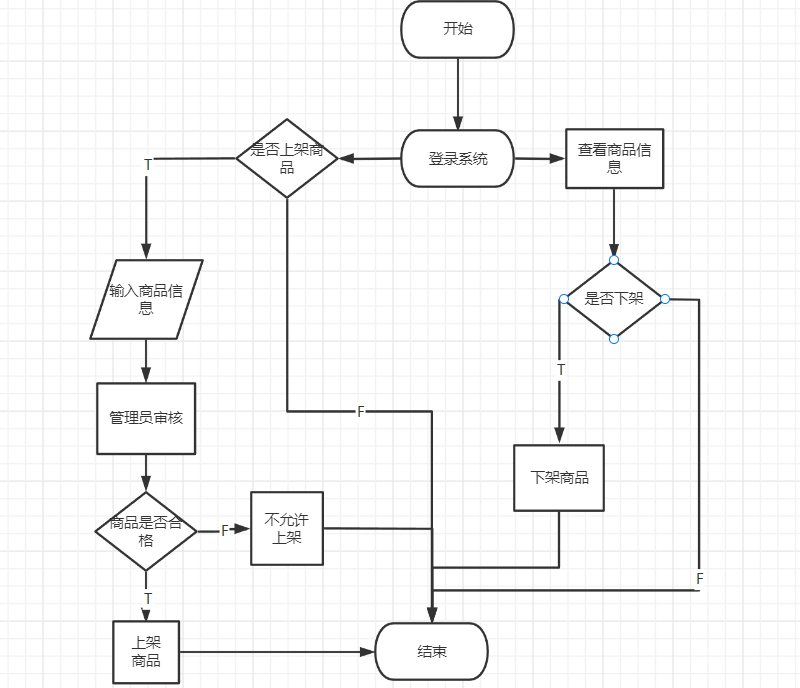
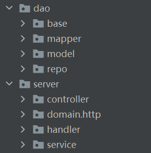

# 网络商城——学信汇软件概要设计 #

### 文件状态： 正式发布
### 文件标识：当前版本： v1.2
### 作者： 姓名 ：  李浩文 王羽桐 张天翔 何明东
### 团队： 111队

## 1. 引言

### 1.1编写目的
#### 从该阶段开发正式进入软件的实际开发阶段，本阶段完成系统的大致设计并明确系统的数据结构与软件结构。在软件设计阶段主要是把一个软件需求转化为软件表示的过程，这种表示只是描绘出软件的总的概貌。本概要设计说明书的目的就是进一步细化软件设计阶段得出的软件总体概貌，把它加工成在程序细节上非常接近于源程序的软件表示。

### 1.2背景
#### 此项目由北京信息科技大学发布招标、111队接受委托开发

### 1.3定义与缩写
### 在该概要设计说明书中的专门术语有：

#### 1.3.1 总体设计
#### 解释：
##### 即对全局问题的设计，也就是设计系统总的处理方案，又称概要设计

#### 1.3.2 接口设计
#### 解释：
##### 软件内部，软件和操作系统间以及软件和人之间如何通信。

#### 1.3.3 数据结构设计
#### 解释：
##### 数据结构是在整个计算机科学与技术领域上广泛被使用的术语。它用来反映一个数据的内部构成，即一个数据由那些成分数据构成，以什么方式构成，呈什么结构。
##### 数据结构有逻辑上的数据结构和物理上的数据结构之分。逻辑上的数据结构反映成分数据之间的逻辑关系，而物理上的数据结构反映成分数据在计算机内部的存储安排。
##### 数据结构主要有三个方面内容：数据的逻辑结构；数据的物理存储结构；对数据的操作或算法。

#### 1.3.4 运行设计
#### 解释：
#### 1. 运行模块的组合
#### 2. 运行控制
#### 3. 运行时间

#### 1.3.5 出错设计
#### 解释：
##### 指软件产品中存在的导致期望的运行结果和实际运行结果间出现差异的一系列问题，这些问题包括故障、失效、缺陷。人为的将错误以某种方式让用户知道。

#### 1.3.6 SQL
#### 解释：
##### Structured Query Language（结构化查询语言）数据结构为关系型数据库，所以，在程序中可以通过 标准的SQL语句与数据结构进行交互，交互过程中采用通用的数据库访问接口。本软件通过springboot连接数据库，因此只要主机上spring boot服务程序即可以与Mysql数据库进行连接，实现对数据库的访问。

#### 1.3.7 JDBC
#### 解释：
##### 连接数据库使用的jar包

#### 1.3.8 拦截器
#### 解释：
##### 拦截所有外部请求

#### 1.3.9 crud
#### 解释：
##### 数据库增删改查操作

### 1.4参考资料
#### 《开发计划》
#### 《需求规格说明书》

## 2 总体设计
### 2.1 需求规定:
 - ### 输入项目：  
   >####  1.用户的注册登录    
   >####  2.用户的销售商品   
   >####  3.商品信息    
   >####  4.商品是否允许议价  
   >####  5.商品数量    
   >####  6.商品价格  
   >####  7.商品的新旧程度  
   >####  8.商品评价
 - ### 输出项目：  
    >#### 1.销售订单   
    >#### 2.商品的列表  
    >#### 3.购物车列表  
    >#### 4.详细物流数据
 - ### 处理的功能新要求：  
    >#### 1.管理员用户审核商品、审核用户注册、管理用户列表    
    >#### 2.钱包和积分功能  
    >#### 3.刷新以实时更新物流数据

### 2.2 运行环境
>#### 1.  Windows7及以上、Linux系统
>#### 2.  联网才能进行软件正常的使用
>#### 3.  未登录用户不能浏览商品信息，登录后才可以使用软件基本功能

### 2.3 基本设计理念和处理流程：

### 2.4 结构：

### 2.5 功能需求与各部分程序的关系：
 - #### 本条用一张如下的矩阵图说明各项功能需求的实现同各模块程序的关系：

|     |  登录  |  输入  |  输出   |  检测  |   
| :-----:| :---: | :----: | :---: | :---: |
| 登录 | √  |  √  |   |   |
| 注册 | √  |  √  |   |   |
| 上架商品 |  |  √  | √ |   |
| 购物车 |  |  √  | √  |   |
| 发布订单 |  |  √  | √  |  √ |

### 2.6 人工处理流程：
####交易过程中买卖双方出现意见分歧，需要人工介入进行调解。
### 2.7 尚未解决的问题：
#### 1. 用户过多并发使用可能会导致软件崩溃，需要进行压力测试。
#### 2. 商品交易及订单生成是否有过高延迟，需要进行软件测试。
### 2.8 自由表述：
无
## 3接口设计
### 3.1用户接口
#### 1. 收货地址业务层的接口，用于对地址的增删改查
   >public interface IAddressService  
#### 2. 购物车业务层的接口，用于购物车的获取以及对购物车中商品的添加和更新，
   >public interface ICartService  
#### 3. 地区业务层的接口， 根据code查询区域名称
   >public interface IDistrictService  
#### 4. 订单业务层的接口，用于创建订单和查询列表
   >public interface IOrderService  
#### 5. 商品业务层的接口，对商品的增删改查和对热搜商品的排序
   >public interface IProductService
#### 6. 用户业务层的接口,用于用户注册，登录，修改密码，修改头像，以及对用户进行查找和更新
   >public interface IUserService  
### 3.2外部接口
#### 3.2.1硬件接口
#### 1. 光纤
#### 2. usb
#### 3. 电源
#### 3.2.2软件接口
#### 1. 获取当前商家待发货所有商品信息
#### 2. 返回当前商家所有的待发货的商品信息
#### 3. 支付接口，通过调用支付宝接口支付
### 3.3内部接口

1. 收货地址持久层的接口 
   >public interface AddressMapper;
   
   插入用户的收货地址数据
   >Integer insert(Address address);
   
   根据用户id统计收货地址数量 
   >Integer countByUid(Integer uid);
   
   根据用户id查询用户收获地址数据
   >List findByUid(Integer uid);

   根据aid查询收货地址数据
   >Address findByAid(Integer aid);
   
   根据用户的uid值来修改用户的收货地址设置为非默认
   >Integer updateNonDefault(Integer uid);
   
   根据收货地址id删除收货地址数据
   >Integer deleteByAid(Integer aid);
   
   根据用户uid查询当前用户最后一次被修改的收货地址数据
   >Address findLastModified(Integer uid);
   
   更新用户地址信息 
   >Integer updateInfoByAid(Address address);
     
2. 购物车持久层的接口
   >public interface CartMapper
   
   插入购物车数据
   >Integer insert(Cart cart);
   
   更新购物车某件商品数量
   >Integer updateNumByCid(Integer cid, Integer num, String modifiedUser, Date modifiedTime);
   
   根据用户id与商品id来查询购物车中数据
   >Cart findByUidAndPid(Integer uid,Integer pid);
   
   根据用户uid查询VO类用户加入购物车的商品列表
   >List<CartVO> findVOByUid(Integer uid);
   
   根据购物车cid值查询商品
   >Cart findByCid(Integer cid);
   
   根据若干个购物车数据id查询详情的列表 
   >List<CartVO> findVOByCids(Integer[] cids);
3. 地区持久层的接口
   >public interface DistrictMapper
   
   根据父代号查询区域信息 
   >List<District> findByParent(String  parent);
   
   根据code查询区域名称
   >String findNameByCode(String code);
4. 订单持久层的接口
   >public interface OrderMapper
   
   插入订单数据
   >Integer insertOrder(Order order);

   插入订单项的数据
   >Integer insertOrderItem(OrderItem orderItem);
   
   根据订单id查询详情的列表
   >List<OrderVO> findVOByOid(Integer oid);
5. 商品持久层的接口
   >public interface ProductMapper
   
   查询热销商品的前四名
   >List<Product> findHotList();
   
   查询评分最高商品前四名
   >List<Product> findMarkList();
   
   查询最贵的前四件商品
   >List<Product> findDescList();
   
   查询最便宜的前四件商品
   >List<Product> findAscList();

   根据商品id查询商品详情
   >Product findById(Integer id);
   
   根据商品名查询商品详情
   >List<Product> findByTitle(String title);
   
   查询所有在售商品
   >List<Product> findAllProducts();
   
   发布商品
   >Integer insert(Product product);
6. 用户持久层的接口
   >public interface UserMapper
   
   插入用户的数据
   >Integer insert(User user);
   
   根据用户名查询用户数据
   >User findByUsername(String username);
   
   根据用户uid来修改用户密码
   >Integer updatePasswordByYid(Integer uid, String password,
   String modifiedUser, Date modifiedTime);
   
   根据用户id查询用户的数据
   >User findByUid(Integer uid);
   
   更新用户的数据信息
   >Integer updateInfoByUid(User user);
   
   根据用户uid值修改用户头像
   >Integer updateAvatarByUid(@Param("uid") Integer uid,
     @Param("avatar") String avatar,
     @Param("modifiedUser") String modifiedUser,
     @Param("modifiedTime")  Date modifiedTime);

## 4运行设计
### 4.1运行模块组合
1. 用户：登录模块+注册模块+商家注册模块+购物车模块
2. 主页：商品模块
3. 商家：管理商品模块+订单模块+退款模块
4. 管理员：登录模块+审核模块+商家管理模块
### 4.2运行控制
1. 在客户端登录后数据库验证账号密码，通过后进入主界面；
2. 新用户注册，提交用户名、密码、短信验证码；
3. 管理员通过注册请求，更新数据库；
4. 主界面显示当前所有在售的商品；
5. 用户购买商品，填写收货信息并付款；
6. 商家发货，买家确认收货，购买流程结束；
7. 商家申请上架商品，提交商品图片和信息审核；
8. 管理员审核商品上架，上架商品流程结束。
### 4.3运行时间
1. 本系统的各个模块之间功能是相互联系的，故各模块占用各种资源的时间是累计的，所以运行时间由顾客
的操作和网络的运行速度决定。
2. 时间规定：用户点击按钮，服务器综合响应时间不超过2s、数据库查询不超过1s、数据处理不得超过1s。

## 5系统数据结构设计
### 5.1逻辑结构设计要点
本系统使用MySql完成数据的存储与数据交互，创建数据库名为store2019011292

_**t_address表**_

<table>
<tr>
    <th>名称</th>
</tr>
<tr>
    <td>收货地址id</td>
</tr>
<tr>
    <td>归属的用户id</td>
</tr>
<tr>
    <td>收货人姓名</td>
</tr>
<tr>
    <td>省-名称</td>
</tr>
<tr>
    <td>省-行政代号</td>
</tr>
<tr>
    <td>市-名称</td>
</tr>
<tr>
    <td>市-行政代号</td>
</tr>
<tr>
    <td>区-名称</td>
</tr>
<tr>
    <td>区-行政代号</td>
</tr>
<tr>
    <td>邮政编码</td>
</tr>
<tr>
    <td>详细地址</td>
</tr>
<tr>
    <td>手机</td>
</tr>
<tr>
    <td>固话</td>
</tr>
<tr>
    <td>标签</td>
</tr>
<tr>
    <td>是否默认：0-不默认，1-默认</td>
</tr>
<tr>
    <td>创建人</td>
</tr>
<tr>
    <td>创建时间</td>
</tr>
<tr>
    <td>修改人</td>
</tr>
<tr>
    <td>修改时间</td>
</tr>

</table>

_**t_cart表**_
<table>
<tr>
    <th>名称</th>
</tr>
<tr>
    <td>购物车数据id</td>
</tr>
<tr>
    <td>用户id</td>
</tr>
<tr>
    <td>商品id</td>
</tr>
<tr>
    <td>加入时商品单价</td>
</tr>
<tr>
    <td>商品数量</td>
</tr>
<tr>
    <td>创建人</td>
</tr>
<tr>
    <td>创建时间</td>
</tr>
<tr>
    <td>修改人</td>
</tr>
<tr>
    <td>修改时间</td>
</tr>
<tr>
    <td>是否删除</td>
</tr>
</table>  

_**t_comment表**_
<table>
<tr>
    <th>名称</th>
</tr>
<tr>
    <td>主键id</td>
</tr>
<tr>
    <td>用户id</td>
</tr>
<tr>
    <td>商家id</td>
</tr>
<tr>
    <td>订单id</td>
</tr>
<tr>
    <td>商品id</td>
</tr>
<tr>
    <td>商品的评价</td>
</tr>
<tr>
    <td>商家的评价</td>
</tr>
<tr>
    <td>商品的评分</td>
</tr>
<tr>
    <td>商家的回复</td>
</tr>
<tr>
    <td>日志-创建人</td>
</tr>
<tr>
    <td>日志-创建时间</td>
</tr>
<tr>
    <td>日志-最后修改执行人</td>
</tr>
<tr>
    <td>日志-最后修改时间</td>
</tr>
</table>  

_**t_dict_district表**_
<table>
<tr>
    <th>名称</th>
</tr>
<tr>
    <td>id</td>
</tr>
<tr>
    <td>parent</td>
</tr>
<tr>
    <td>code</td>
</tr>
<tr>
    <td>name</td>
</tr>
</table>

**t_order表**
<table>
<tr>
    <th>名称</th>
</tr>
<tr>
    <td>订单id</td>
</tr>
<tr>
    <td>用户id</td>
</tr>
<tr>
    <td>收货人姓名</td>
</tr>
<tr>
    <td>收货人电话</td>
</tr>
<tr>
    <td>收货人所在省</td>
</tr>
<tr>
    <td>收货人所在市</td>
</tr>
<tr>
    <td>收货人所在区</td>
</tr>
<tr>
    <td>收货详细地址</td>
</tr>
<tr>
    <td>总价</td>
</tr>
<tr>
    <td>状态</td>
</tr>
<tr>
    <td>下单时间</td>
</tr>
<tr>
    <td>支付时间</td>
</tr>

<tr>
    <td>创建人</td>
</tr>
<tr>
    <td>创建时间</td>
</tr>
<tr>
    <td>修改人</td>
</tr>
<tr>
    <td>修改时间</td>
</tr>
</table>

_**t_order_item表**_
<table>
<tr>
    <th>名称</th>
</tr>
<tr>
    <td>订单中的商品记录的id</td>
</tr>
<tr>
    <td>所归属的订单的id</td>
</tr>
<tr>
    <td>商品的id</td>
</tr>
<tr>
    <td>商品标题</td>
</tr>
<tr>
    <td>商品图片</td>
</tr>
<tr>
    <td>商品价格</td>
</tr>
<tr>
    <td>购买数量</td>
</tr>
<tr>
    <td>创建人</td>
</tr>
<tr>
    <td>创建时间</td>
</tr>
<tr>
    <td>修改人</td>
</tr>
<tr>
    <td>修改时间</td>
</tr>
<tr>
    <td>商品状态</td>
</tr>
</table>

**t_purse_record_user表**
<table>
<tr>
    <th>名称</th>
</tr>
<tr>
    <td>金额变化记录id</td>
</tr>
<tr>
    <td>用户id</td>
</tr>
<tr>
    <td>用户名</td>
</tr>
<tr>
    <td>用户当前余额</td>
</tr>
<tr>
    <td>用户充值金额</td>
</tr>
<tr>
    <td>用户扣除金额</td>
</tr>
<tr>
    <td>用户购买的商品的id</td>
</tr>
<tr>
    <td>日志-创建人</td>
</tr>
<tr>
    <td>日志-创建时间</td>
</tr>
<tr>
    <td>日志-最后修改执行人</td>
</tr>
<tr>
    <td>日志-最后修改时间</td>
</tr>
</table>

**t_user表**
<table>
<tr>
    <th>名称</th>
</tr>
<tr>
    <td>用户id</td>
</tr>
<tr>
    <td>用户名</td>
</tr>
<tr>
    <td>密码</td>
</tr>
<tr>
    <td>盐值</td>
</tr>
<tr>
    <td>电话号码</td>
</tr>
<tr>
    <td>电子邮箱</td>
</tr>
<tr>
    <td>性别</td>
</tr>
<tr>
    <td>头像</td>
</tr>
<tr>
    <td>是否删除</td>
</tr>
<tr>
    <td>创建人</td>
</tr>
<tr>
    <td>创建时间</td>
</tr>
<tr>
    <td>修改人</td>
</tr>
<tr>
    <td>修改时间</td>
</tr>
<tr>
    <td>城市</td>
</tr>
<tr>
    <td>银行账号</td>
</tr>
<tr>
    <td>用户类型</td>
</tr>
<tr>
    <td>是否通过审核</td>
</tr>
<tr>
    <td>钱包</td>
</tr>
<tr>
    <td>买家等级</td>
</tr>
<tr>
    <td>用户积分</td>
</tr>

</table>

### 5.2物理结构设计要点

通过dao层与数据库交互，进行数据操作

DAO面向表，Service面向业务。后端开发时先数据库设计出所有表，然后对每一张表设计出DAO层，然后根据具体的业务逻辑进一步封装DAO层成一个Service层，对外提供成一个服务。

### 5.3数据结构与程序的关系
通过前端的调用、数据交换等操作在controller提供的接口，在service层进行数据的逻辑操作最后通过model层进行数据与数据库的相应操作。

## 6系统出错处理设计
### 6.1出错信息
1. 在用户使用错误的数据或访问没有权限的数据以及在用户操作非法时，系统会给出相应的警告提示。
2. 在用户错误的操作可能导致网页的跳转出现错误。
3. 数据库与服务器断开可能导致数据加载不成功。
### 6.2补救措施
数据库采用腾讯云服务器技术，提供数据服务与数据安全保障
1. 提供实时数据备份能力，通过数据库备份DBS（冷备）或者数据传输DTS（热备）构建备份中心。当业务中心故障时，将业务流量切换到本地数据中心、或者备份中心RPO：0- 秒级
2. 数据备份DBS安全能力 提供云数据库的数据库备份能力和方案。具备备份压缩、加密、备份数据查询和单表恢复等。
### 6.3系统维护设计
网站必须按照面向对象的软件工程的步骤进行开发，并充分考虑软件可维护性，软件的模块划分满足高内聚、低耦合的特点，同时程序的内部必须有详细的注释和统一的编码格式、按时认真的进行相应文档的龚写和备份工作，以利于未来版本的开发迭代与维护