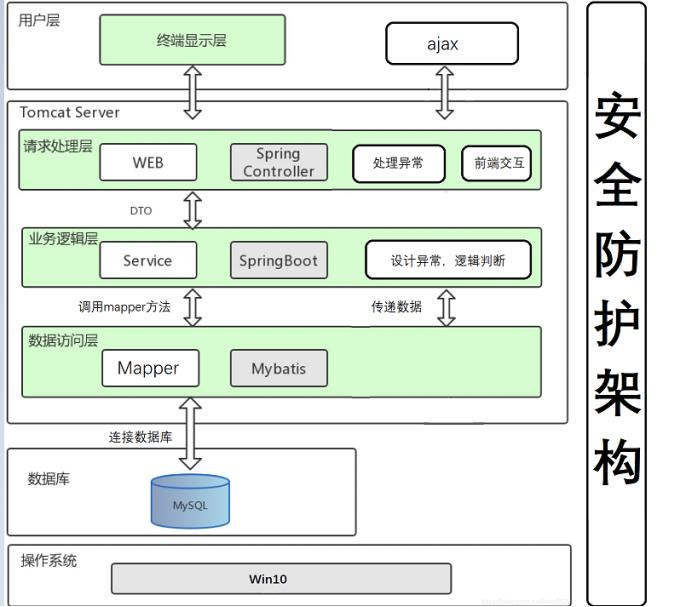
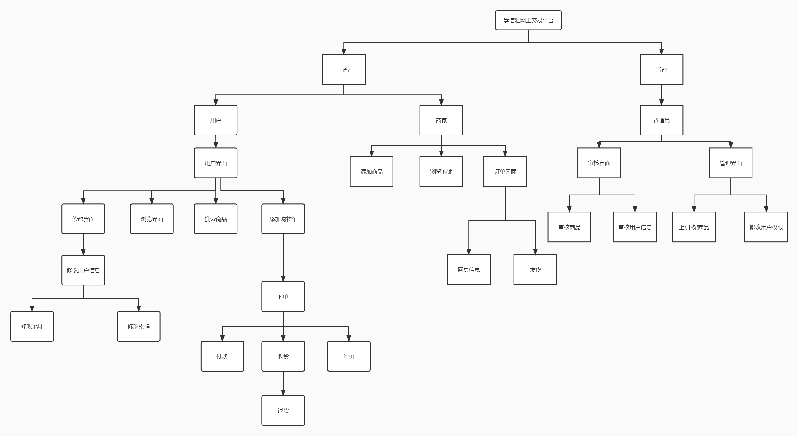
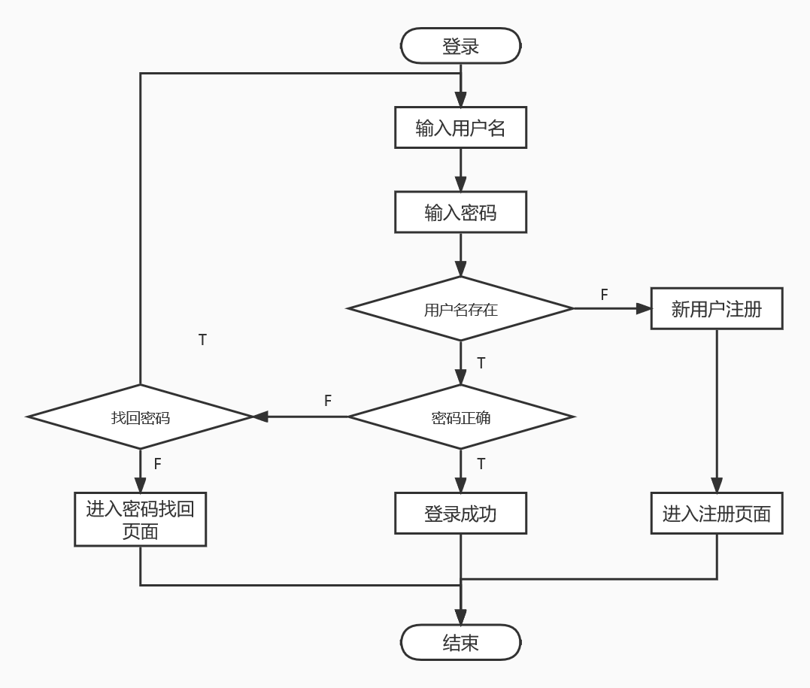
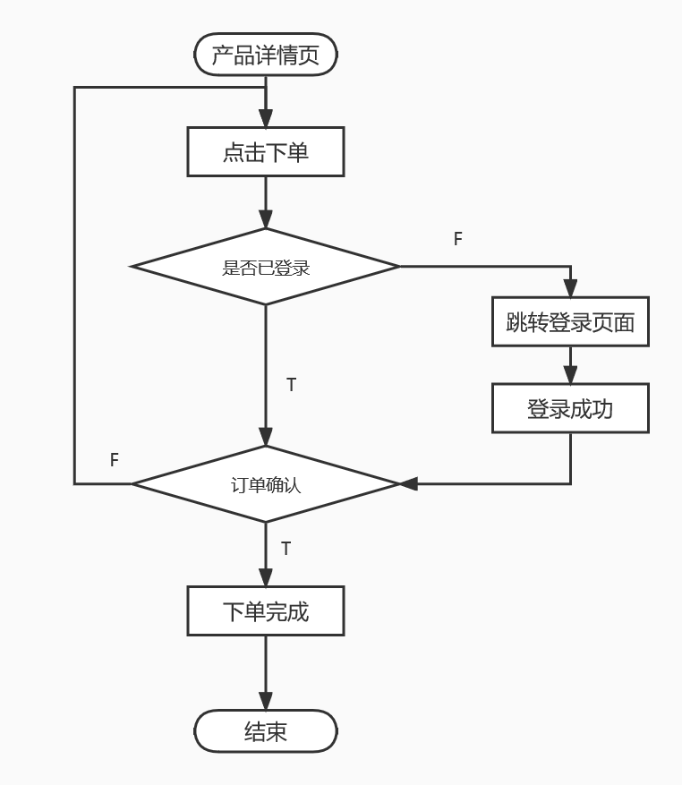
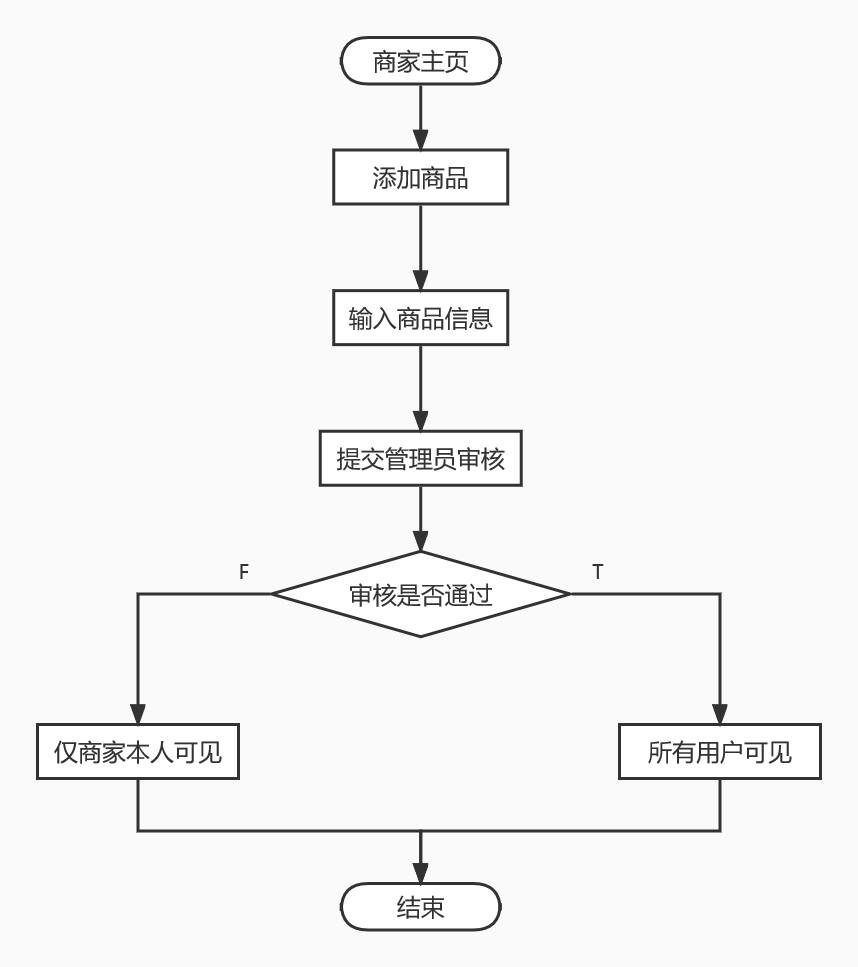
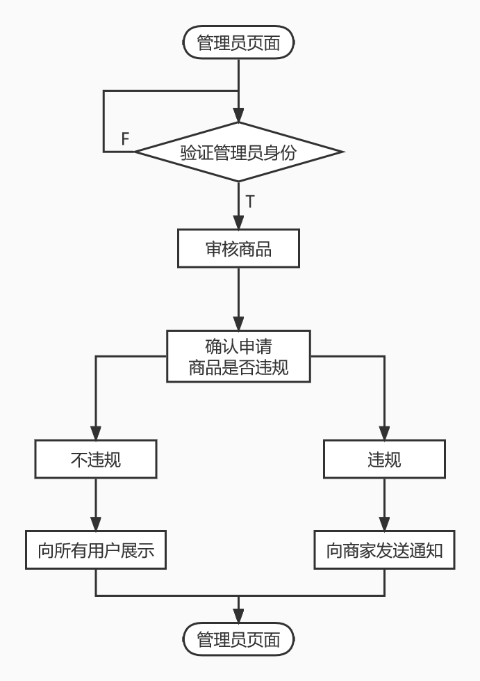
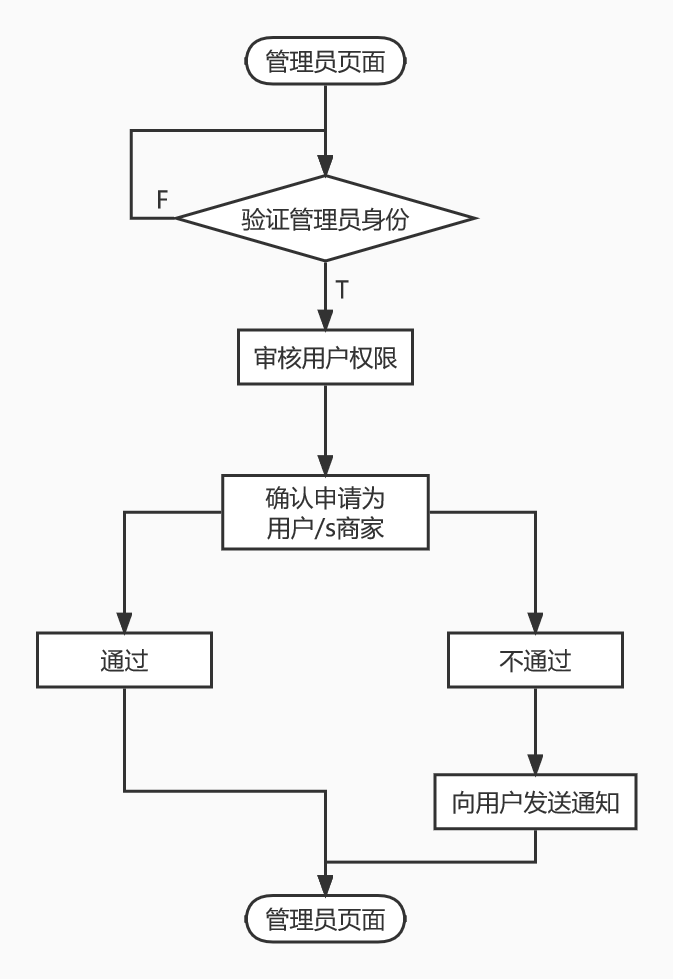
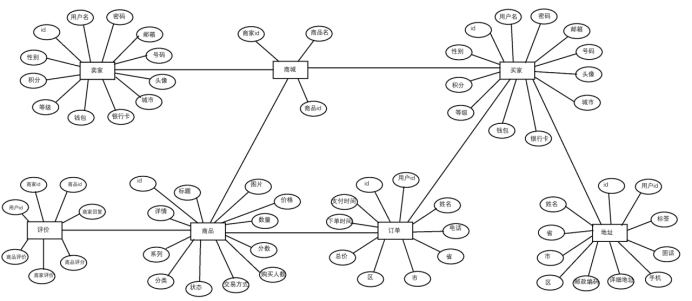

# 网络商城——学信汇详细设计说明书 #
**编号:** 20190927  
**版本:** 1.01  
**作者:**  
&emsp;姓名: 张骞 韩文白 黄绍宸 宋博文 于培政  
&emsp;学号: 2019011206 2019011192 2019011193 2019011292 2019011204  
&emsp;团队: 111队  
**完成日期：**  2022/9/27  
**文件状态：**  <u>正式发布</u>  
**文件标识：**  <u>正式发布</u> 
  
**版本更新信息：**  在逻辑上正确地实现学信汇系统每个模块的功能

# 1.引言 

**使用人员：**  交易平台买家与卖家，管理员   

**编写目的：** 详细设计说明书旨在逻辑上正确地实现每个模块的功能和对目标系统的算法、数据表示和数据结构、实施的功能和使用的数据之间的关系精确描述，从而在编码阶段可以把这个描述直接翻译成用某种程序设计语言书写的程序。

**背景：**  
    a.名称： 学信汇网上交易平台（网络商城系统）     
    b.说明：随着经济的迅速发展与科技日新月异的进步，家庭内的各项物品更新换代频率越来越快，人们购买新商品后越来越多旧的商品积压需要处理；在互联网电商的各种营销刺激下，消费者非常容易形成“冲动” 消费，因而产生了大量的闲置、二手物品。现阶段物价越来越高，加之生活压力越来越大，百姓生活成本也在逐步提高。随着经济意识的不断增强，生活习惯和消费观念也在悄然改变，人们逐渐倾向于购买便宜而又实惠的二手商品。  
   在此背景下，大量二手物品交易市场应运而生，二手物品的交易已成为国民经济中不可缺少的一部分。二手商品交易平台，是基于一种新的思想，文化，理念的生活方式，伴随互联网及移动端的高速发 展，快速、便利、精准地为百姓提供高性价比的二手物品，既能满足百姓日益增长的生活需要，又可促进可利用资源的循环使用，减少资源的浪费。在注重商品交易的同时，更多的考虑到环境保护因素，贴合时下主流文化，让每个人在交易的同时，能够参与到环境保护中。 
   眼下，国家大力提倡节能环保、低碳行为，让市民家中闲置的二手物品流通起来产生效益，有望成为一个热门生意。我们将自己设计创建主要以孝义市为市场的二手交易平台，推出“C2C+C2B+C2B2C”的服务式平台，自建一套独立完善的物流系统，带给顾客一种全新的服务体验。结合多功能的网站交易平台和一体化的物流配送服务，力使我们的平台得到最大化的推广，让我们的平台成为孝义及周边地区有影响力的二手交易的品牌。 

**定义与缩写:**  
术语:md5算法  
解释:MD5信息摘要算法（英语：MD5 Message-Digest Algorithm），一种被广泛使用的密码散列函数，可以产生出一个128位（16字节）的散列值（hash value），用于确保信息传输完整一致。

**参考资料:**  
条目:https://baike.baidu.com/item/MD5/212708
  
  # 2.程序系统的结构
**系统架构图：**   
&emsp;
---
**程序系统的结构：**  
&emsp;

# 3.单元设计说明
## 标识符：用户单元  
**程序描述**：  
>游客可访问学信汇主界面进行商品浏览和模糊查询，点击商品名称可浏览商品详细信息。
游客可通过浏览学信汇网站登录界面进行注册和登录。
游客注册待管理员审核通过后可进行登录学信汇主页面进行充值，评论，修改信息等功能。
用户在商品详细界面点击加入购物车可在购物车界面查看到用户添加到购物车的商品。
用户通过点击结算按钮进行商品结算，用户可点击一键下单进行下单或者在线支付选择积分支付或者在线支付。
商品状态为收货以后用户可以点击收货进行收货或者退款，若超过24小时则商品无法退货。
用户收货完成以后可以进行商品评价为其他用户提供参考。
    
**功能**：  
>1.用户注册功能模块：用户通过输入账号，密码，城市，电话，银行卡号等相关信息进行注册，注册成功后用户跳转至登录界面进行登录，同时用户信息也会提交至数据库。  
>2.用户搜索功能模块：用户通过搜索栏搜索想要的商品进行浏览商品，也可通过模糊查询进行商品的搜索。  
>3.用户购物车功能模块：用户通过浏览商品详细信息界面将感兴趣的商品添加到购物车。  
>4.用户订单功能模块：用户在购物车界面勾选感兴趣的商品进行下单，系统跳转到订单界面，用户可点击一键下单或者在线支付进行下单，下单后商家进行发货，当商品状态信息显示到货以后用户可点击收货或者退货，当商家同意退货以后用户资金和积分自动返还。  
>5.用户修改信息功能模块：用户可在管理模块进行密码，资料，头像，地址的修改。  
>6.用户评价功能模块：对于收货的商品用户可进行评价，商家可进行回复评价。

**算法**：  
>md5算法:对用户的密码进行加密防止有人恶意盗取密码进行刷单等不法行为。  

**流程逻辑**：  
1.用户登录流程图：  
    
2.用户下单流程图：  
    

**接口**：  
>1.IUserService.impl:处理用户数据的业务层接口  
>2.IAddressService.impl:收货地址业务层接口  
>3.ICartService.impl:购物车业务层接口  
>4.ICommentService.impl:用户评论业务层接口  
>5.IDistrictService.impl:用户地址业务层接口  
>6.IOrderService.impl:订单和订单数据的业务层接口

**注释设计**：  
>文档注释:利用JDK提供的javadoc工具将文档注释提取出来生成一份API帮助文档。其中包含用户接口的文档注释，数据实体的文档注释，用户业务层，控制层的文档注释  

**测试计划**：
>1.对用户登录界面进行并发测试检测系统的抗压性。  
>2.对用户订单界面进行接口测试。  
>3.对系统进行黑盒测试和白盒测试。  
>注：详细测试计划见测试计划文档。

**尚未解决的问题**：
>对于用户的在线支付功能尚未解决。

## 标识符：商家单元
**程序描述**：  
>用户通过注册并上传商家营业执照，进行商家身份的注册。
商家待管理员通过审核后跳转到登录界面，商家登录到商家主界面。
商家可点击上传商品到自己的商品橱柜，待管理员审核完成以后商品可被所有用户看到并购买，若商品未通过审核则商家商品仅自己可见但用户无法被看到。
用户下单商品以后商家可点击发货，待用户收货以后商家才可获得尾款。
用户对商品进行的评价商家可进行回复供其他用户参考。 
 
**功能**：  
>1.商家注册功能模块：用户通过输入账号，密码，城市，电话，银行卡号，商家营业执照等相关信息进行注册，待管理员审核通过算注册成功，注册成功后商家跳转至登录界面进行登录，同时用户信息也会提交至数据库。  
>2.商家橱窗功能模块：商家可浏览自己上传的商品的信息和上架\下架的商品信息。  
>3.商家上传商品功能模块：商家上传希望售卖商品的信息。  
>4.商家订单功能模块：商家对于用户下单的商品以及商品的状态进行发货，退货，拒绝退货。  
>5.商家修改信息功能模块：商家可在管理模块进行密码，资料，商家营业执照，地址的修改。  
>6.商家评价功能模块：对于收货的商品用户可进行评价，商家可进行回复评价。
 
**流程逻辑**：   
1.商家添加商品流程图：  

**接口**：  
>1.IUserService.impl:处理用户(商家)数据的业务层接口  
>2.IAddressService.impl:收货地址业务层接口  
>3.ICartService.impl:购物车业务层接口  
>4.ICommentService.impl:用户(商家)评论业务层接口  
>5.IDistrictService.impl:用户(商家)地址业务层接口  
>6.IOrderService.impl:订单和订单数据的业务层接口

**注释设计**：  
>文档注释:利用JDK提供的javadoc工具将文档注释提取出来生成一份API帮助文档。其中包含业务层接口的文档注释，数据实体的文档注释，业务层，控制层的文档注释  

**测试计划**：
>1.对商家登录界面进行并发测试检测系统的抗压性。  
>2.对商家订单界面进行接口测试。  
>3.对系统进行黑盒测试和白盒测试。  
>注：详细测试计划见测试计划文档。

**尚未解决的问题**：
>对于商家的在线收款功能尚未解决。

## 标识符：管理员单元
**程序描述**：
>用户通过注册成为管理员，输入正确的管理员资格码后可成功注册管理员身份。
管理员跳转到管理主界面进行用户注册管理，商家商品上架管理。

**功能**：
>1.管理员注册功能模块：用户通过输入账号，密码，城市，电话，银行卡号，管理员资格码等相关信息进行注册，管理员资格码审核通过算注册成功，注册成功后管理员跳转至登录界面进行登录，同时管理员信息也会提交至数据库。  
>2.管理员审核用户功能模块：管理员进入该模块后会展示进行注册的用户或商家或管理员的注册信息，管理员可以点击通过或者驳回进行审核。  
>3.管理员审核商品功能模块：管理员对商家上传的商品信息进行审核，对于合规商品进行通过，不合规商品进行驳回。  

**算法**：
>无

**流程逻辑**：   
1.管理员审核商家商品流程图：  
    
2.管理员审核用户权限流程图：  
    

**接口**：  
>1.IUserService.impl:处理用户/商家/管理员数据的业务层接口  
>2.IAddressService.impl:收货地址业务层接口  
>3.ICartService.impl:购物车业务层接口  
>4.ICommentService.impl:用户/商家/管理员评论业务层接口  
>5.IDistrictService.impl:用户/商家/管理员地址业务层接口  
>6.IOrderService.impl:订单和订单数据的业务层接口
 
**注释设计**：  
>文档注释:利用JDK提供的javadoc工具将文档注释提取出来生成一份API帮助文档。其中包含业务层接口的文档注释，数据实体的文档注释，业务层，控制层的文档注释  
 
**测试计划**：
>1.对管理员登录界面进行并发测试检测系统的抗压性。  
>2.对管理员审核界面进行接口测试。  
>3.对系统进行黑盒测试和白盒测试。  
>注：详细测试计划见测试计划文档  

**尚未解决的问题**：
>暂无

# 4.数据库设计 
**4.1 外部设计：**   
1. 数据库类型, Navicat
2. 数据库版本,15.0.25
3. 数据库运行环境  
   &emsp;(1). 正式环境  
   &emsp;&emsp;硬件信息:  
   &emsp;&emsp;CPU: Intel(R) Xeon(R) Gold 6161 CPU @ 2.20GHz 内存:8GB 固态硬盘:无机械硬盘:500GB  
   &emsp;&emsp;软件信息: 移动客户端服务器部署在linux centos， 操作系统为Windows 10 64bit，Web中间件为,Apache/2.4.39 (Unix)  
   &emsp;(2). 开发环境  
   &emsp;&emsp;a. tomcat  
   &emsp;&emsp;b. windows10
4. 数据库前缀/表前缀  
   &emsp;(1). t_
5. 数据库名称 store2019011292
6. 数据库权限  
   &emsp;(1). root用户,只能本地登录
7. 用户名  
   &emsp;(1). root
8. 密码要求  
   &emsp;(1). 随机生成16位,其中必须包含 A-Z/ a-z /0-9 /!@#$%^&*  
   &emsp;(2). 上线后, 数据库密码每个月要更换一次
9. 端口  
   &emsp;1. 3307
10. 有效时间  
    &emsp;1. 开发阶段  
    &emsp;2. 生产阶段

**4.2 结构设计：**  
&emsp;**概念设计：**
&emsp;  

&emsp;**逻辑结构设计：**  
&emsp;用户(编号，用户名，密码，电话，城市，地址，权限)  
&emsp;商品(编号，商家编号，名字，价格，数量，描述)  
&emsp;购物车（卖家编号，买家编号，商品编号，数量）   
&emsp;账单（账单编号，买家编号，卖家编号，商品编号，日期，数量，是否评价
&emsp;评论（评论编号，内容，用户编号，评论时间，商品编号，卖家编号，评分  
&emsp;申请（申请编号，用户编号，银行卡号，就业执照)  

_**t_address表**_  

<table>
<tr>
    <th>名称</th>
    <th>类型</th>
    <th>长度</th>
    <th>注释</th>
</tr>
<tr>
    <td>aid</td>
    <td>int</td>
    <td>11</td>
    <td>收货地址id</td>
</tr>
<tr>
    <td>uid</td>
    <td>int</td>
    <td>11</td>
    <td>收件人id</td>
</tr>
<tr>
    <td>name</td>
    <td>varchar</td>
    <td>20</td>
    <td>收件人姓名</td>
</tr>
<tr>
    <td>Province_name</td>
    <td>varchar</td>
    <td>15</td>
    <td>省-名称</td>
</tr>
<tr>
    <td>Province_code</td>
    <td>char</td>
    <td>6</td>
    <td>省-行政代号</td>
</tr>
<tr>
    <td>city_name</td>
    <td>varchar</td>
    <td>15</td>
    <td>市-名称</td>
</tr>
<tr>
    <td>city_code</td>
    <td>char</td>
    <td>6</td>
    <td>市-行政代号</td>
</tr>
<tr>
    <td>area_name</td>
    <td>varchar</td>
    <td>15</td>
    <td>区-名称</td>
</tr>
<tr>
    <td>area_code</td>
    <td>char</td>
    <td>6</td>
    <td>区-行政代号</td>
</tr>
<tr>
    <td>zip</td>
    <td>char</td>
    <td>6</td>
    <td>邮政编码</td>
</tr>
<tr>
    <td>address</td>
    <td>varchar</td>
    <td>50</td>
    <td>详细地址</td>
</tr>
<tr>
    <td>phone</td>
    <td>varchar</td>
    <td>20</td>
    <td>手机号</td>
</tr>
<tr>
    <td>tel</td>
    <td>varchar</td>
    <td>20</td>
    <td>固定电话</td>
</tr>
<tr>
    <td>tag</td>
    <td>varchar</td>
    <td>6</td>
    <td>标签</td>
</tr>
<tr>
    <td>is_default</td>
    <td>int</td>
    <td>11</td>
    <td>是否默认;0-不默认，1-默认</td>
</tr>
<tr>
    <td>created_user</td>
    <td>varchar</td>
    <td>20</td>
    <td>创建人</td>
</tr>
<tr>
    <td>created_time</td>
    <td>datetime</td>
    <td></td>
    <td>创建时间</td>
</tr>
<tr>
    <td>modified_user</td>
    <td>varchar</td>
    <td>20</td>
    <td>修改人</td>
</tr>
<tr>
    <td>modified_time</td>
    <td>datetime</td>
    <td></td>
    <td>修改时间</td>
</tr>

</table>

_**t_cart表**_
<table>
<tr>
    <th>名称</th>
    <th>类型</th>
    <th>长度</th>
    <th>注释</th>
</tr>
<tr>
    <td>cid</td>
    <td>int</td>
    <td>11</td>
    <td>购物车数据id</td>
</tr>
<tr>
    <td>uid</td>
    <td>int</td>
    <td>11</td>
    <td>用户id</td>
</tr>
<tr>
    <td>pid</td>
    <td>int</td>
    <td>11</td>
    <td>商品id</td>
</tr>
<tr>
    <td>price</td>
    <td>bigint</td>
    <td>20</td>
    <td>加入时商品单价</td>
</tr>
<tr>
    <td>num</td>
    <td>int</td>
    <td>11</td>
    <td>商品数量</td>
</tr>
<tr>
    <td>created_user</td>
    <td>varchar</td>
    <td>20</td>
    <td>创建人</td>
</tr>
<tr>
    <td>created_time</td>
    <td>datatime</td>
    <td></td>
    <td>创建时间</td>
</tr>
<tr>
    <td>modified_user</td>
    <td>varchar</td>
    <td>20</td>
    <td>修改人</td>
</tr>
<tr>
    <td>modified_time</td>
    <td>datatime</td>
    <td></td>
    <td>修改时间</td>
</tr>
<tr>
    <td>cstatus</td>
    <td>int</td>
    <td>1</td>
    <td>是否删除</td>
</tr>
</table>  

_**t_comment表**_
<table>
<tr>
    <th>名称</th>
    <th>类型</th>
    <th>长度</th>
    <th>注释</th>
</tr>
<tr>
    <td>id</td>
    <td>int</td>
    <td>10</td>
    <td>主键id</td>
</tr>
<tr>
    <td>uid</td>
    <td>int</td>
    <td>10</td>
    <td>用户id</td>
</tr>
<tr>
    <td>bid</td>
    <td>int</td>
    <td>10</td>
    <td>商家id</td>
</tr>
<tr>
    <td>oid</td>
    <td>int</td>
    <td>10</td>
    <td>订单id</td>
</tr>
<tr>
    <td>pid</td>
    <td>int</td>
    <td>10</td>
    <td>商品id</td>
</tr>
<tr>
    <td>p_comment</td>
    <td>varchar</td>
    <td>255</td>
    <td>商品的评价</td>
</tr>
<tr>
    <td>b_comment</td>
    <td>varchar</td>
    <td>255</td>
    <td>商家的评价</td>
</tr>
<tr>
    <td>judge_mark</td>
    <td>int</td>
    <td>10</td>
    <td>商品的评分</td>
</tr>
<tr>
    <td>reply</td>
    <td>varchar</td>
    <td>255</td>
    <td>商家的回复</td>
</tr>
<tr>
    <td>created_user</td>
    <td>varchar</td>
    <td>20</td>
    <td>日志-创建人</td>
</tr>
<tr>
    <td>created_time</td>
    <td>datatime</td>
    <td></td>
    <td>日志-创建时间</td>
</tr>
<tr>
    <td>modified_user</td>
    <td>varchar</td>
    <td>20</td>
    <td>日志-最后修改执行人</td>
</tr>
<tr>
    <td>modified_time</td>
    <td>datatime</td>
    <td></td>
    <td>日志-最后修改时间</td>
</tr>
</table>  

_**t_dict_district表**_
<table>
<tr>
    <th>名称</th>
    <th>类型</th>
    <th>长度</th>
    <th>注释</th>
</tr>
<tr>
    <td>id</td>
    <td>int</td>
    <td>11</td>
    <td>主键</td>
</tr>
<tr>
    <td>parent</td>
    <td>varchar</td>
    <td>6</td>
    <td></td>
</tr>
<tr>
    <td>code</td>
    <td>varchar</td>
    <td>6</td>
    <td></td>
</tr>
<tr>
    <td>name</td>
    <td>varchar</td>
    <td>16</td>
    <td></td>
</tr>
</table>

**t_order表**
<table>
<tr>
    <th>名称</th>
    <th>类型</th>
    <th>长度</th>
    <th>注释</th>
</tr>
<tr>
    <td>oid</td>
    <td>int</td>
    <td>11</td>
    <td>订单id</td>
</tr>
<tr>
    <td>uid</td>
    <td>int</td>
    <td>11</td>
    <td>用户id</td>
</tr>
<tr>
    <td>recv_name</td>
    <td>varchar</td>
    <td>20</td>
    <td>收货人姓名</td>
</tr>
<tr>
    <td>recv_phone</td>
    <td>varchar</td>
    <td>20</td>
    <td>收货人电话</td>
</tr>
<tr>
    <td>recv_province</td>
    <td>varchar</td>
    <td>15</td>
    <td>收货人所在省</td>
</tr>
<tr>
    <td>recv_city</td>
    <td>varchar</td>
    <td>15</td>
    <td>收货人所在市</td>
</tr>
<tr>
    <td>recv_area</td>
    <td>varchar</td>
    <td>15</td>
    <td>收货人所在区</td>
</tr>
<tr>
    <td>recv_address</td>
    <td>varchar</td>
    <td>50</td>
    <td>收货人所在具体地址</td>
</tr>
<tr>
    <td>total_price</td>
    <td>bigint</td>
    <td>20</td>
    <td>总价</td>
</tr>
<tr>
    <td>status</td>
    <td>int</td>
    <td>11</td>
    <td>状态.0-未支付，1-已支付，2-已收款，3-申请退款，4-已完成</td>
</tr>
<tr>
    <td>order_time</td>
    <td>datetime</td>
    <td></td>
    <td>下单时间</td>
</tr>
<tr>
    <td>pay_time</td>
    <td>datetime</td>
    <td></td>
    <td>支付时间</td>
</tr>

<tr>
    <td>created_user</td>
    <td>varchar</td>
    <td>20</td>
    <td>日志-创建人</td>
</tr>
<tr>
    <td>created_time</td>
    <td>datatime</td>
    <td></td>
    <td>日志-创建时间</td>
</tr>
<tr>
    <td>modified_user</td>
    <td>varchar</td>
    <td>20</td>
    <td>日志-最后修改执行人</td>
</tr>
<tr>
    <td>modified_time</td>
    <td>datatime</td>
    <td></td>
    <td>日志-最后修改时间</td>
</tr>
</table>

_**t_order_item表**_
<table>
<tr>
    <th>名称</th>
    <th>类型</th>
    <th width="70">长度</th>
    <th>注释</th>
</tr>
<tr>
    <td>id</td>
    <td>int</td>
    <td>11</td>
    <td>订单中的商品记录的id</td>
</tr>
<tr>
    <td>oid</td>
    <td>int</td>
    <td>11</td>
    <td>所归属的订单id</td>
</tr>
<tr>
    <td>pid</td>
    <td>int</td>
    <td>11</td>
    <td>商品的id</td>
</tr>
<tr>
    <td>title</td>
    <td>varchar</td>
    <td>100</td>
    <td>商品的标题</td>
</tr>
<tr>
    <td>image</td>
    <td>varchar</td>
    <td>500</td>
    <td>商品的图片</td>
</tr>
<tr>
    <td>price</td>
    <td>bigint</td>
    <td>20</td>
    <td>商品的价格</td>
</tr>
<tr>
    <td>num</td>
    <td>int</td>
    <td>11</td>
    <td>购买数量</td>
</tr>
<tr>
    <td>created_user</td>
    <td>varchar</td>
    <td>20</td>
    <td>创建人</td>
</tr>
<tr>
    <td>created_time</td>
    <td>datatime</td>
    <td></td>
    <td>创建时间</td>
</tr>
<tr>
    <td>modified_user</td>
    <td>varchar</td>
    <td>20</td>
    <td>修改人</td>
</tr>
<tr>
    <td>modified_time</td>
    <td>datatime</td>
    <td></td>
    <td>修改时间</td>
</tr>
<tr>
    <td>p_status</td>
    <td>int</td>
    <td>1</td>
    <td>商品状态 0 未发货 1已发货 2 已到货 3 已收货 4交易完成 5申请退货 6退货完成 7退货驳回</td>
</tr>
</table>

**t_purse_record_user表**
<table>
<tr>
    <th>名称</th>
    <th>类型</th>
    <th>长度</th>
    <th>注释</th>
</tr>
<tr>
    <td>id</td>
    <td>int</td>
    <td>20</td>
    <td>金额变化记录id</td>
</tr>
<tr>
    <td>uid</td>
    <td>int</td>
    <td>11</td>
    <td>用户id</td>
</tr>
<tr>
    <td>username</td>
    <td>varchar</td>
    <td>20</td>
    <td>用户名</td>
</tr>
<tr>
    <td>purse</td>
    <td>int</td>
    <td>10</td>
    <td>用户当前金额</td>
</tr>
<tr>
    <td>add_count</td>
    <td>int</td>
    <td>10</td>
    <td>用户充值金额</td>
</tr>
<tr>
    <td>sub_count</td>
    <td>int</td>
    <td>10</td>
    <td>用户扣除金额</td>
</tr>
<tr>
    <td>pid</td>
    <td>int</td>
    <td>11</td>
    <td>用户购买的商品的id</td>
</tr>
<tr>
    <td>created_user</td>
    <td>varchar</td>
    <td>20</td>
    <td>日志-创建人</td>
</tr>
<tr>
    <td>created_time</td>
    <td>datatime</td>
    <td></td>
    <td>日志-创建时间</td>
</tr>
<tr>
    <td>modified_user</td>
    <td>varchar</td>
    <td>20</td>
    <td>日志-最后修改执行人</td>
</tr>
<tr>
    <td>modified_time</td>
    <td>datatime</td>
    <td></td>
    <td>日志-最后修改时间</td>
</tr>
</table>

**t_user表**
<table>
<tr>
    <th>名称</th>
    <th>类型</th>
    <th>长度</th>
    <th>注释</th>
</tr>
<tr>
    <td>uid</td>
    <td>int</td>
    <td>11</td>
    <td>用户id</td>
</tr>
<tr>
    <td>username</td>
    <td>varchar</td>
    <td>20</td>
    <td>用户名</td>
</tr>
<tr>
    <td>password</td>
    <td>char</td>
    <td>32</td>
    <td>密码</td>
</tr>
<tr>
    <td>salt</td>
    <td>char</td>
    <td>36</td>
    <td>盐值</td>
</tr>
<tr>
    <td>phone</td>
    <td>varchar</td>
    <td>20</td>
    <td>手机号</td>
</tr>
<tr>
    <td>email</td>
    <td>varchar</td>
    <td>30</td>
    <td>电子邮箱</td>
</tr>
<tr>
    <td>gender</td>
    <td>int</td>
    <td>11</td>
    <td>性别：0：女，1：男</td>
</tr>
<tr>
    <td>avatar</td>
    <td>varchar</td>
    <td>50</td>
    <td>头像</td>
</tr>
<tr>
    <td>is_delete</td>
    <td>int</td>
    <td>11</td>
    <td>是否删除：0：未删除，1：已删除</td>
</tr>
<tr>
    <td>created_user</td>
    <td>varchar</td>
    <td>20</td>
    <td>日志-创建人</td>
</tr>
<tr>
    <td>created_time</td>
    <td>datatime</td>
    <td></td>
    <td>日志-创建时间</td>
</tr>
<tr>
    <td>modified_user</td>
    <td>varchar</td>
    <td>20</td>
    <td>日志-最后修改执行人</td>
</tr>
<tr>
    <td>modified_time</td>
    <td>datatime</td>
    <td></td>
    <td>日志-最后修改时间</td>
</tr>
<tr>
    <td>city</td>
    <td>varchar</td>
    <td>255</td>
    <td>城市</td>
</tr>
<tr>
    <td>bankAccount</td>
    <td>varchar</td>
    <td>255</td>
    <td>银行卡帐号</td>
</tr>
<tr>
    <td>userType</td>
    <td>varchar</td>
    <td>255</td>
    <td>用户类型 0代表普通用户 1代表管理员 2代表商家</td>
</tr>
<tr>
    <td>is_pass</td>
    <td>int</td>
    <td>255</td>
    <td>是否审核通过</td>
</tr>
<tr>
    <td>purse</td>
    <td>int</td>
    <td>255</td>
    <td>钱包</td>
</tr>
<tr>
    <td>level</td>
    <td>int</td>
    <td>2</td>
    <td>卖家等级</td>
</tr>
<tr>
    <td>point</td>
    <td>int</td>
    <td>20</td>
    <td>用户积分</td>
</tr>
</table>

&emsp;**物理设计：**  
&emsp;数据结构为关系型数据库，所以，在程序中可以通过标准的SQL语句与数据结构进行交互，交互过程中
采用通用的数据库访问接口。本软件通过springboot连接数据库，因此只要主机上spring boot服务程
序即可以与Mysql数据库进行连接，实现对数据库的访问。  

**4.3 运行设计：**  
**数据字典设计:**  
字典类别表：（字典类名称，类型，长度，注释）  

**购物车数据的Value Object**  
<table>
<tr>
    <th>名称</th>
    <th>类型</th>
    <th>长度</th>
    <th>注释</th>
</tr>
<tr>
    <td>cid</td>
    <td>int</td>
    <td>11</td>
    <td>购物车数据id</td>
</tr>
<tr>
    <td>uid</td>
    <td>int</td>
    <td>11</td>
    <td>用户id</td>
</tr>
<tr>
    <td>pid</td>
    <td>int</td>
    <td>11</td>
    <td>商品id</td>
</tr>
<tr>
    <td>price</td>
    <td>bigint</td>
    <td>20</td>
    <td>加入时商品单价</td>
</tr>
<tr>
    <td>num</td>
    <td>int</td>
    <td>11</td>
    <td>商品数量</td>
</tr>
<tr>
    <td>title</td>
    <td>varchar</td>
    <td>100</td>
    <td>商品的标题</td>
</tr>
<tr>
    <td>image</td>
    <td>varchar</td>
    <td>500</td>
    <td>商品的图片</td>
</tr>
</table>
 
**订单数据的Value Object**  
<table>
<tr>
    <th>名称</th>
    <th>类型</th>
    <th>长度</th>
    <th>注释</th>
</tr>
<tr>
    <td>uid</td>
    <td>int</td>
    <td>11</td>
    <td>用户id</td>
</tr>
<tr>
    <td>pid</td>
    <td>int</td>
    <td>11</td>
    <td>商品id</td>
</tr>
<tr>
    <td>oid</td>
    <td>int</td>
    <td>10</td>
    <td>订单id</td>
</tr>
<tr>
    <td>price</td>
    <td>bigint</td>
    <td>20</td>
    <td>加入时商品单价</td>
</tr>
<tr>
    <td>num</td>
    <td>int</td>
    <td>11</td>
    <td>商品数量</td>
</tr>
<tr>
    <td>recv_name</td>
    <td>varchar</td>
    <td>20</td>
    <td>收货人姓名</td>
</tr>
<tr>
    <td>order_time</td>
    <td>datetime</td>
    <td></td>
    <td>下单时间</td>
</tr>
<tr>
    <td>pay_time</td>
    <td>datetime</td>
    <td></td>
    <td>支付时间</td>
</tr>
<tr>
    <td>title</td>
    <td>varchar</td>
    <td>100</td>
    <td>商品的标题</td>
</tr>
<tr>
    <td>image</td>
    <td>varchar</td>
    <td>500</td>
    <td>商品的图片</td>
</tr>
</table>

**支付数据的Value Object**   
<table>
<tr>
    <th>名称</th>
    <th>类型</th>
    <th>长度</th>
    <th>注释</th>
</tr>
<tr>
    <td>uid</td>
    <td>int</td>
    <td>11</td>
    <td>用户id</td>
</tr>
<tr>
    <td>pid</td>
    <td>int</td>
    <td>11</td>
    <td>商品id</td>
</tr>
<tr>
    <td>oid</td>
    <td>int</td>
    <td>10</td>
    <td>订单id</td>
</tr>
<tr>
    <td>pay_time</td>
    <td>datetime</td>
    <td></td>
    <td>支付时间</td>
</tr>
<tr>
    <td>status</td>
    <td>int</td>
    <td>11</td>
    <td>状态.0-未支付，1-已支付，2-已收款，3-申请退款，4-已完成</td>
</tr>
<tr>
    <td>num</td>
    <td>int</td>
    <td>11</td>
    <td>商品数量</td>
</tr>
<tr>
    <td>p_status</td>
    <td>int</td>
    <td>1</td>
    <td>商品状态 0 未发货 1已发货 2 已到货 3 已收货 4交易完成 5申请退货 6退货完成 7退货驳回</td>
</tr>
<tr>
    <td>price</td>
    <td>bigint</td>
    <td>20</td>
    <td>加入时商品单价</td>
</tr>
</table>     
        
**安全保密设计:**  
&emsp;root用户只能本地登录，对于用户的密码采用md5算法进行加密。

