# 网络商城——学信汇测试报告
## 状态与版本信息:
>文件状态：正式发布  
>文件标识：001  
>当前版本：V1.1
> - 作者：
> > 姓名：于培政  
>   学号：2019011204  
>   团队：111队
>
> > 完成日期：2022.10.11
>
> - 版本更新信息
> >v1.0 发布项目测试报告
> - 编号：001
> - 项目阶段：测试阶段
> - 项目经理：张骞

## 1.  引言
### 1.1 使用人员
> 二手商品买家
> 二手商品卖家
> 系统挂利用管理员>

### 1.2 编写目的
> 本测试计划旨在对整个软件的测试进行系统的规划，包括测试的方法、功能时间、流程做出整体的规划，
保证可以及时发现系统的错误和缺陷，并改善。

### 1.3 背景
> 系统名称：网络商城——学信汇  
> 开发历史：后端开发完成、前端开发完成  
> 项目测试：个人电脑、网络服务器

### 1.4 定义与缩写
#### 1.4.1 术语
> 缺陷
#### 1.4.2 解释
> 软件缺陷（Defect），常常又被叫做Bug。所谓软件缺陷，即为计算机软件或程序中存在的某种破坏正
常运行能力的问题、错误，或者隐藏的功能缺陷。缺陷的存在会导致软件产品在某种程度上不能满足
用户的需要。IEEE729-1983对缺陷有一个标准的定义：从产品内部看，缺陷是软件产品开发或维护过
程中存在的错误、毛病等各种问题；从产品外部看，缺陷是系统所需要实现的某种功能的失效或违
背。

### 1.5 参考资料
> 《软件设计文档国家标准》 GB-T 8567-2006  
> 《软件项目管理》机械工业出版社  
> 《软件工程》北京大学出版社

## 2.  测试概要
### 2.1 测试用例
### 2.2 测试环境与配置
#### 2.2.1 硬件环境：
>1.推荐配置：  
>处理器：   AMD Ryzen 7 4800H with Radeon Graphics    2.90 GHz    
>机带： RAM    16.0GB (15.9GB 可用)    
>系统类型：  64 位操作系统, 基于 x6
>网络：    宽带互联网连接  
>存储空间：  至少512MB可用空间  
>显卡：    无要求
>
> 2.最低配置：
>处理器：   1 GHz 或更快的处理器或 系统单芯片（SoC）  
>机带： RAM    1 GB（32 位）或 2 GB（64 位）    
>系统类型：  32 位操作系统    
>网络：    宽带互联网连接    
>存储空间：  至少512MB可用空间    
>显卡：    无要求
#### 2.2.2 软件环境：
>操作系统：Windows7/10  
>数据库类型及版本：Navicat 15.0.25-Premium /mysql 5.1.49  
>前端服务器：ECMAScript6（JavaScript6）  
>后端服务器运行库：  
>JRE7以上版本  
>SpringBoot v2.6.5  
>Tomcat 8.0及以上版本
>mybatis 2.2.2
#### 2.2.3 测试方法与工具
测试方法为白盒测试方法  
测试工具：Junit为主要测试，环境为IDEA、JDK8、MySQL
### 2.3 测试方法和工具
## 3.  测试结果
###3.1 地址功能测试
> （1）测试执行情况与记录    
> 1.增加地址功能:  
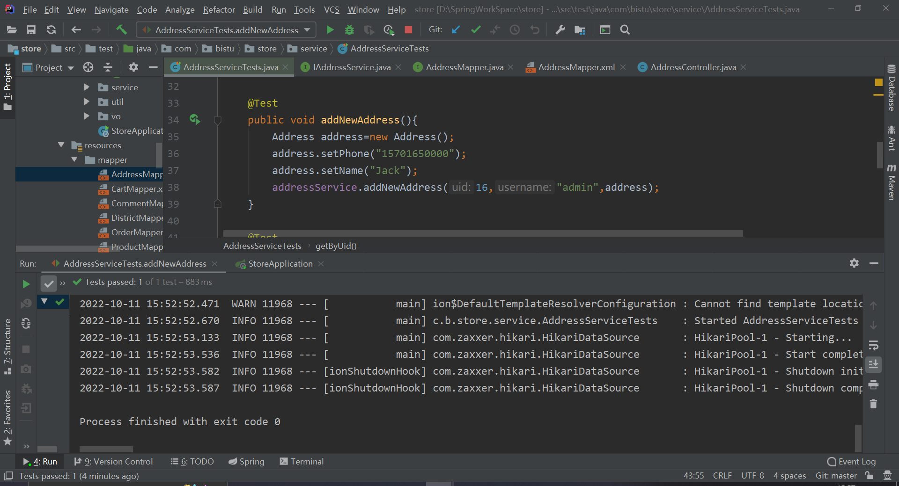  
2.根据用户id查询地址:  
   
3.根据地址id修改地址  
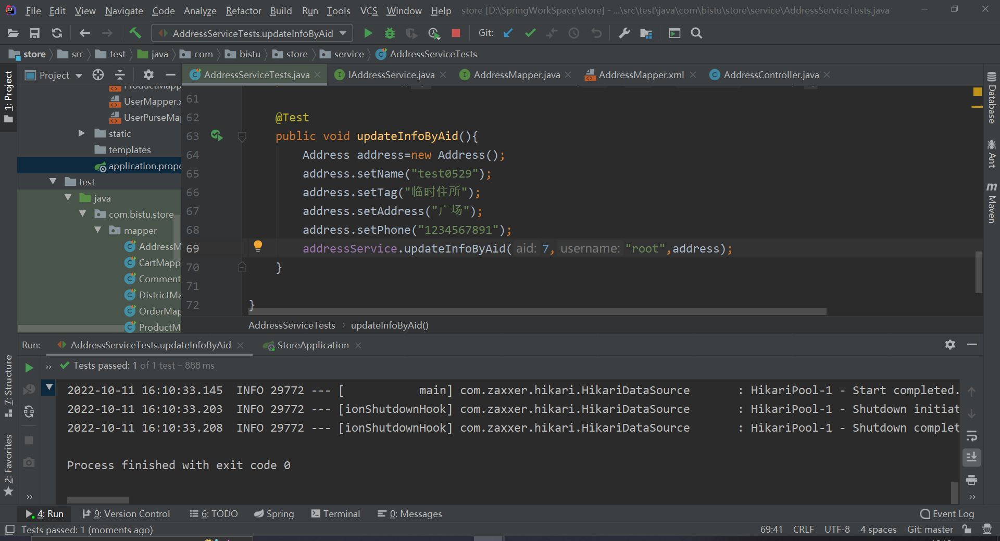
  
4.删除地址信息  
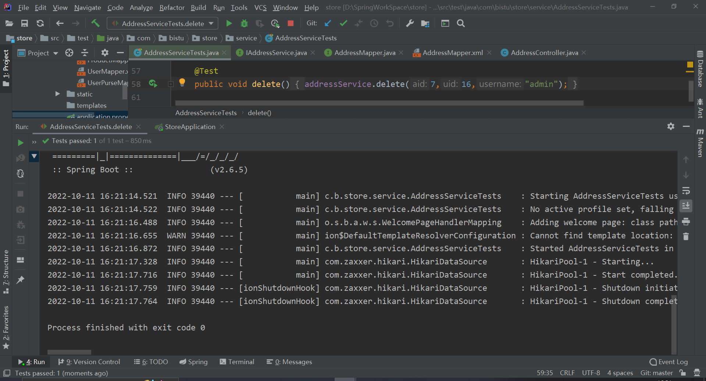
> （2）覆盖分析

###3.2 购物车功能测试
> （1）测试执行情况与记录  
> 1.添加商品到购物车:    
    
2.删除购物车商品:    
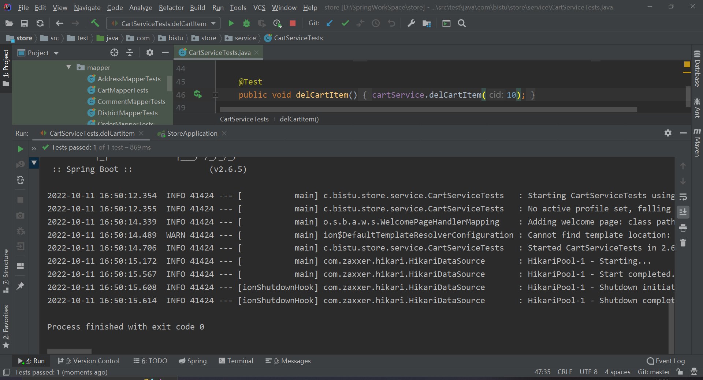     
3.增加购物车中商品数量    
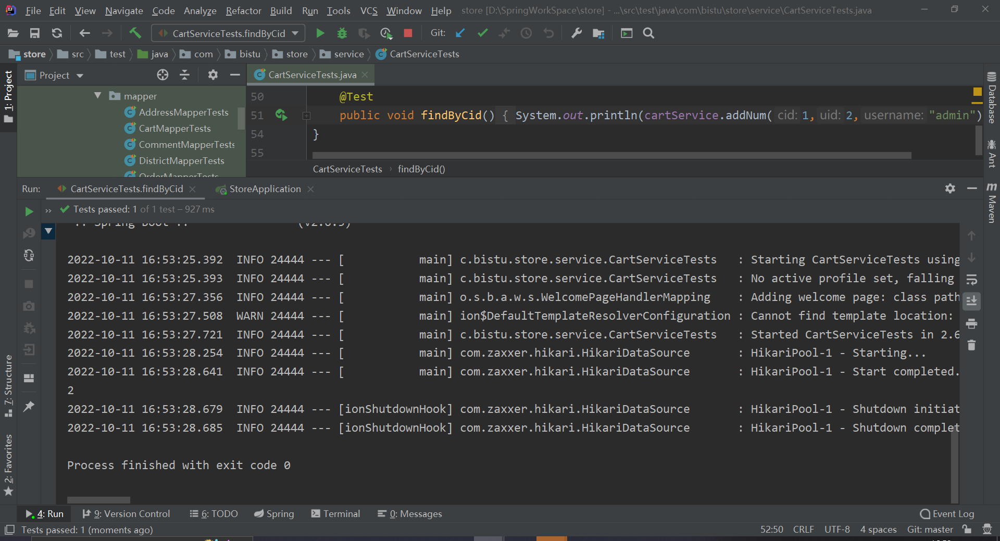   
    
4.根据用户id获取购物车数据    

> （2）覆盖分析

###3.3 评论功能测试
> （1）测试执行情况与记录  
> 1.插入评论    
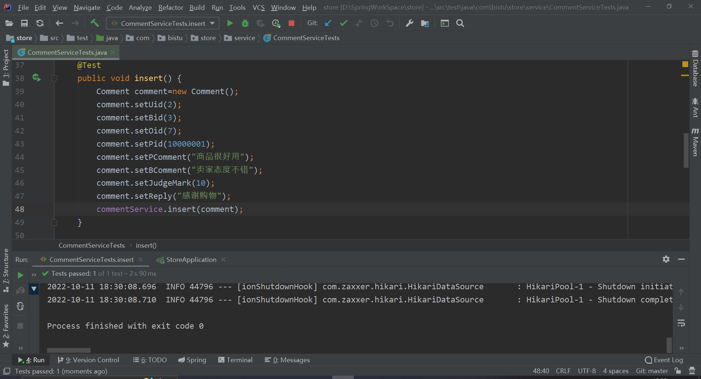
2.根据商家id更新评论

3.根据用户id查找评论

> （2）覆盖分析

###3.4 订单功能测试
> （1）测试执行情况与记录  
> 1.创建订单  
     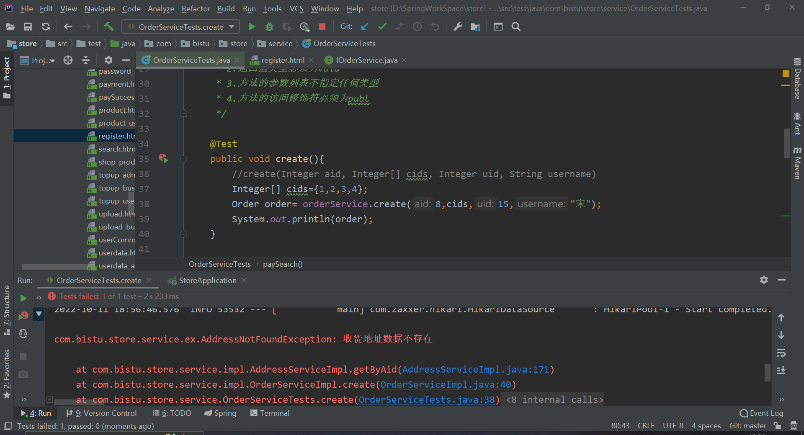  
     
2.更新订单状态  
   
3.根据订单id查询订单信息  
   
> （2）覆盖分析

###3.5 产品功能测试
> （1）测试执行情况与记录  
> 1.插入商品  
     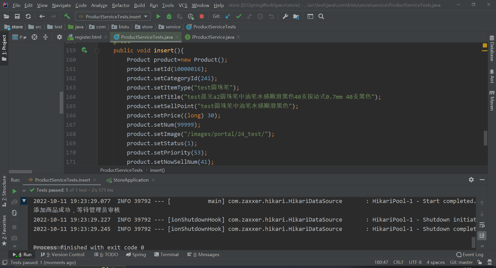
2.搜索商品（热销/价格升序/价格降序/所有商品/审核通过商品的查找功能类似）  
   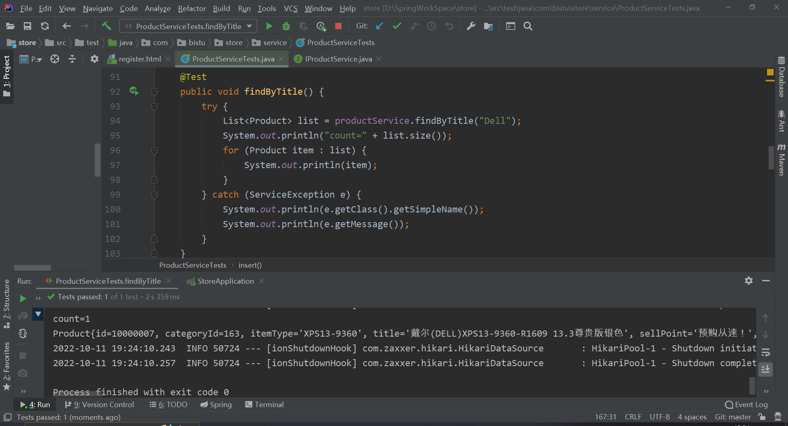
3.审核商品  
   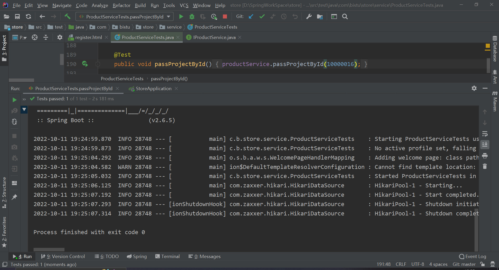
4.上架/下架商品   
   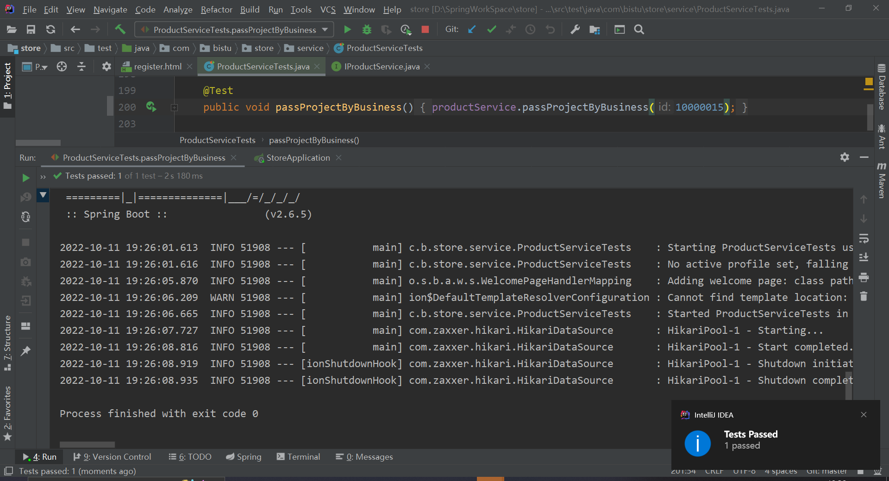
> （2）覆盖分析
> 

###3.6 用户功能测试
> （1）测试执行情况与记录  
> 1.注册功能  
       
     
2.登录功能  
     
     
   
3.修改密码功能  
     
   
4.审核用户注册信息  
   
5.增加金钱  
     
> （2）覆盖分析
<table>
     <tr>
     <th>测试功能</th>
     <th>输入数据</th>
     <th>预期结果</th>
     <th>预期覆盖情况</th>
     </tr>
     <tr>
         <td>注册功能</td>
         <td> user.setUsername("test1011");  
                     user.setPassword("123");  
                     user.setBankAccount("1234567891234567");  
                     user.setUserType("123123");  </td>  
         <td >注册成功</td>
         <td rowspan="2">100%</td>
         </tr>
     <tr>
         <td>注册功能</td>
         <td> user.setUsername("root"); 
                     user.setPassword("123");  
                     user.setBankAccount("1234567891234567"); user.setUserType("123123");</td>
         <td >用户名被占用</td>
         </tr>
     <tr>
         <td>登录功能</td>
         <td>username="root" password="123"</td>
         <td>登录成功</td>
         <td rowspan="5">100%</td>
         </tr>
     <tr>
    <tr>
         <td>登录功能</td>
         <td>username="root1" password="123"</td>
         <td>用户数据不存在</td>
         </tr>
     <tr>
     <tr>
         <td>登录功能</td>
         <td>username="root" password="1234"</td>
         <td>用户密码错误</td>
         </tr>
     <tr>
              <td>修改密码功能</td>
              <td>uid=2 username="test0" oldPassword="321" newPassword="123"</td>
              <td>密码错误</td>
              <td rowspan="5">100%</td>
              </tr>
          <tr>
     <tr>
         <td>修改密码功能</td>
         <td>uid=2 username="test0" oldPassword="123" newPassword="321"</td>
         <td>修改成功</td>
         </tr>
     <tr>
     <tr>
         <td>修改密码功能</td>
         <td>uid=2 username="test0" oldPassword="321" newPassword="123"</td>
         <td>修改成功</td>
         </tr>
     <tr>
         <td>审核用户注册信息</td>
         <td>uid=2</td>
         <td>用户账号冻结</td>
         <td rowspan="2">100%</td>
         </tr>
     <tr>
         <td>增加金钱</td>
         <td>uid=2 purse=14000 modifiedUser="root" new Date()</td>
         <td>成功</td>
         </tr>
 </table>
## 4.  缺陷的统计与分析

### 4.1 地址功能
> （1）缺陷统计  
> （2）缺陷分析

### 4.2 购物车功能
> （1）缺陷统计  
> （2）缺陷分析

### 4.3 评论功能
> （1）缺陷统计  
> （2）缺陷分析

### 4.4 订单功能
> （1）缺陷统计  
> （2）缺陷分析

### 4.5 产品功能
> （1）缺陷统计  
> （2）缺陷分析

### 4.6 用户功能
> （1）缺陷统计  
> （2）缺陷分析
## 5.  测试结论与建议
### 5.1 地址功能结论
> （1）结论  
>1.增加地址功能能够正常运行  
2.根据用户id查询地址能够正常运行    
3.根据地址id修改地址能够正常运行    
4.删除地址信息能够正常运行  
> （2）分析
>   
### 5.2 购物车功能结论
> （1）结论  
1.添加商品到购物车功能正常运行    
2.删除购物车商品正常运行      
3.增加购物车中商品数量正常运行      
4.根据用户id获取购物车数据正常运行   
> （2）分析  
> 数据全部定义为String，不太严谨，测试传参时找不出所对应的问题
> 
### 5.3 评论功能结论
> （1）结论   
> 1.插入评论能够正常运行  
2.根据商家id更新评论能够正常运行  
3.根据用户id查找评论能够正常运行  
4.根据商家id查找评论(同根据用户id查找评论内容类似，故不在此测试)能够正常运行  
5.根据商品id查找评论(同根据用户id查找评论内容类似，故不在此测试)能够正常运行    
> （2）分析  

 
### 5.4 订单功能结论
> （1）结论  
> 1.创建订单正常运行  
> 2.更新订单状态正常运行  
> 3.根据订单id查询订单信息正常运行  
> （2）分析
> 
### 5.5 产品功能结论
> （1）结论    
> 1.插入商品正常运行  
2.搜索商品（热销/价格升序/价格降序/所有商品/审核通过商品的查找功能类似）正常运行  
3.审核商品正常运行  
4.上架/下架商品正常运行  
> （2）分析  

### 5.6 用户功能结论
> （1）结论   
> 1.注册功能正常运行  
2.登录功能正常运行  
3.修改密码功能正常运行  
4.审核用户注册信息正常运行  
5.增加金钱正常运行  
> （2）分析  
> 程序需要进一步细致的确认信息的合法输入性。
