# 网络商城——学信汇测试用例
#### 状态与版本信息
**文件状态：**<u>正式发布</u>  
**文件标识：**<u>正式发布</u>  
**当前版本：**<u>正式发布</u>  

**作者:**  
&emsp;姓名:宋博文  
&emsp;学号:2019011292  
&emsp;团队: 111队

**完成日期：**  2022/10/11  
**版本更新信息：** 对系统设计测试用例对系统进行了单元测试和接口测试。

# 1.引言  
### 1.1使用人员     
&emsp;交易平台买家与卖家，管理员  
### 1.2编写目的  
&emsp;为帮助用户了解该交易平台的功能和使用环境，辅助用户实现安装和使用该平台。受众对象为广大在校师生。
### 1.3背景      
&emsp;a.名称： 学信汇网上交易平台（网络商城系统）     
&emsp;b.说明：随着经济的迅速发展与科技日新月异的进步，家庭内的各项物品更新换代频率越来越快，人们购买新商品后越来越多旧的商品积压需要处理；在互联网电商的各种营销刺激下，消费者非常容易形成“冲动” 消费，因而产生了大量的闲置、二手物品。现阶段物价越来越高，加之生活压力越来越大，百姓生活成本也在逐步提高。随着经济意识的不断增强，生活习惯和消费观念也在悄然改变，人们逐渐倾向于购买便宜而又实惠的二手商品。  
在此背景下，大量二手物品交易市场应运而生，二手物品的交易已成为国民经济中不可缺少的一部分。二手商品交易平台，是基于一种新的思想，文化，理念的生活方式，伴随互联网及移动端的高速发 展，快速、便利、精准地为百姓提供高性价比的二手物品，既能满足百姓日益增长的生活需要，又可促进可利用资源的循环使用，减少资源的浪费。在注重商品交易的同时，更多的考虑到环境保护因素，贴合时下主流文化，让每个人在交易的同时，能够参与到环境保护中。
眼下，国家大力提倡节能环保、低碳行为，让市民家中闲置的二手物品流通起来产生效益，有望成为一个热门生意。我们将自己设计创建主要以孝义市为市场的二手交易平台，推出“C2C+C2B+C2B2C”的服务式平台，自建一套独立完善的物流系统，带给顾客一种全新的服务体验。结合多功能的网站交易平台和一体化的物流配送服务，力使我们的平台得到最大化的推广，让我们的平台成为孝义及周边地区有影响力的二手交易的品牌。
### 1.4定义与缩写  
1.4.1术语 功能测试    
1.4.2解释 功能测试就是对产品的各功能进行验证，根据功能测试用例，逐项测试，检查产品是否达到用户要求的功能。   
1.4.3术语 单元测试  
1.4.4解释 单元测试（模块测试）是开发者编写的一小段代码，用于检验被测代码的一个很小的、很明确的功能是否正确。

### 1.5参考资料  
1.5.1条目  
+ 任永昌编著.软件工程.清华大学出版社,2012.07.

1.5.2参考文献
+ https://blog.csdn.net/qq_40794986/article/details/120416192
+ https://www.taodocs.com/p-490757309.html

# 2.测试项目

### 2.1单元测试
**测试项目名称：**
地址功能单元测试  
**测试人员：**
宋博文  
**测试时间：**
2022/10/11  
**测试内容：**  
service层功能正确性测试  

地址功能测试功能如下：  
1.增加地址功能  
2.根据用户id查询地址  
3.根据地址id修改地址  
4.删除地址信息  

**测试环境与系统配置：**
操作系统：Windows7/10  
数据库类型及版本：Navicat 15.0.25-Premium /mysql 5.1.49  
前端服务器：ECMAScript6（JavaScript6）  
后端服务器运行库：  
JRE7以上版本  
SpringBoot v2.6.5  
Tomcat 8.0及以上版本
mybatis 2.2.2 

**测试输入数据：**  
<table>
    <tr>
    <th>测试功能</th>
    <th>输入数据</th>
    <th>预期结果</th>
    </tr>
    <tr>
    <td>增加地址</td>
    <td>uid=15  username=admin  address.phone=15701651967  address.name=Jack</td>
    <td>成功增加</td>
    </tr>
    <tr>
    <td>根据用户id查询地址</td>
    <td>uid=2</td>
    <td>查询成功</td>
    </tr>
    <tr>
        <td>根据地址id修改地址</td>
        <td>aid=7  username=root  address.setName("test0529") address.setTag("临时住所") address.setAddress("广场") address.setPhone("1234567891")</td>
        <td>成功修改</td>
        </tr>
    <tr>
        <td>根据地址id修改地址</td>
        <td>aid=6  username=root  username=admin</td>
        <td>收货地址不存在</td>
        </tr>
    <tr>
        <td>删除地址信息</td>
        <td>aid=7  uid=16  username=admin</td>
        <td>删除成功</td>
        </tr>
</table>

**测试次数：**
5次  

**预期结果：**
如上表

**测试过程：**  
1.增加地址功能:  
>@Test  
>     public void addNewAddress(){  
         Address address=new Address();  
         address.setPhone("15701650000");  
         address.setName("Jack");  
         addressService.addNewAddress(15,"admin",address);  
     }  
> 
2.根据用户id查询地址  
>@Test
     public void getByUid(){
         System.out.println(addressService.getByUid(2));
     }
>
3.根据地址id修改地址  
> @Test
     public void updateInfoByAid(){
         Address address=new Address();
         address.setName("test0529");
         address.setTag("临时住所");
         address.setAddress("广场");
         address.setPhone("1234567891");
         addressService.updateInfoByAid(6,"root",address);
     }
>
4.删除地址信息  
>@Test
      public void delete(){
          addressService.delete(2,15,"admin");
      }
 >

**测试结果：**  
1.增加地址功能:  
  
2.根据用户id查询地址:  
   
3.根据地址id修改地址  
 
  
4.删除地址信息  
   

**测试结论：**  
1.增加地址功能能够正常运行  
2.根据用户id查询地址能够正常运行    
3.根据地址id修改地址能够正常运行    
4.删除地址信息能够正常运行  

**实现限制：** 无  

**备注：** 无

---
**测试项目名称：**
购物车功能单元测试  
**测试人员：**
宋博文  
**测试时间：**
2022/10/11  
**测试内容：**  
service层功能正确性测试  

购物车功能测试功能如下：  
1.添加商品到购物车  
2.删除购物车商品  
3.增加购物车中商品数量  
4.根据用户id获取购物车数据     

**测试环境与系统配置：**
操作系统：Windows7/10  
数据库类型及版本：Navicat 15.0.25-Premium /mysql 5.1.49  
前端服务器：ECMAScript6（JavaScript6）  
后端服务器运行库：  
JRE7以上版本  
SpringBoot v2.6.5  
Tomcat 8.0及以上版本
mybatis 2.2.2 

**测试输入数据：**  
<table>
     <tr>
     <th>测试功能</th>
     <th>输入数据</th>
     <th>预期结果</th>
     </tr>
     <tr>
     <td>添加商品到购物车</td>
     <td>uid=2  pid=10000003 amount=5 username="admin"</td>
     <td>成功增加</td>
     </tr>
     <tr>
         <td>删除购物车商品</td>
         <td>cid=10</td>
         <td>删除成功</td>
         </tr>
     <tr>
         <td>增加购物车中商品数量</td>
         <td>cid=1 user=3 username="admin"</td>
         <td>数据非法访问</td>
         </tr>
     <tr>
         <td>增加购物车中商品数量</td>
         <td>cid=1 user=2 username="admin"</td>
         <td>增加成功</td>
         </tr>
     <tr>
         <td>根据用户id获取购物车数据</td>
         <td>uid=2</td>
         <td>查询成功</td>
         </tr>
 </table>

**测试次数：**
5次  

**预期结果：**
如上表

**测试过程：**  
1.添加商品到购物车:  
>@Test  
    public void addToCart(){  
        //已存在的一件购物车中的数据更新  
        cartService.addToCart(2,10000003,5,"admin");    
    }  
> 
2.删除购物车商品  
>@Test
    public void delCartItem(){
        cartService.delCartItem(10);
    }
>
3.增加购物车中商品数量  
> @Test
    public void findByCid(){
        System.out.println(cartService.addNum(1,2,"admin"));
    }

>
4.根据用户id获取购物车数据  
>@Test
    public void getVOByUid(){
        System.out.println(cartService.getVOByUid(2));
    }
>

**测试结果：**  
1.添加商品到购物车:    
    
2.删除购物车商品:    
     
3.增加购物车中商品数量    
   
    
4.根据用户id获取购物车数据    
     

**测试结论：**  
1.添加商品到购物车功能正常运行    
2.删除购物车商品正常运行      
3.增加购物车中商品数量正常运行      
4.根据用户id获取购物车数据正常运行         

**实现限制：**
无 

**备注：**
无

---
**测试项目名称：**
评论功能单元测试  
**测试人员：**
宋博文  
**测试时间：**
2022/10/11  
**测试内容：**  
service层功能正确性测试  

评论功能测试功能如下：
1.插入评论  
2.根据商家id更新评论
3.根据用户id查找评论
4.根据商家id查找评论(同根据用户id查找评论内容类似，故不在此测试)
5.根据商品id查找评论(同根据用户id查找评论内容类似，故不在此测试)

**测试环境与系统配置：**
操作系统：Windows7/10  
数据库类型及版本：Navicat 15.0.25-Premium /mysql 5.1.49  
前端服务器：ECMAScript6（JavaScript6）  
后端服务器运行库：  
JRE7以上版本  
SpringBoot v2.6.5  
Tomcat 8.0及以上版本
mybatis 2.2.2 

**测试输入数据：**  
<table>
     <tr>
     <th>测试功能</th>
     <th>输入数据</th>
     <th>预期结果</th>
     </tr>
     <tr>
         <td>插入评论</td>
         <td>comment.setUid(2);
                      comment.setBid(3);
                      comment.setOid(7);
                      comment.setPid(10000001);
                      comment.setPComment("商品很好用");
                      comment.setBComment("卖家态度不错");
                      comment.setJudgeMark(10);
                      </td>
         <td>插入成功</td>
         </tr>
     <tr>
         <td>根据商家id更新评论</td>
         <td>uid=2 bid=3 oid=7 pid=10000001 reply="感谢您的购买"</td>
         <td>更新成功</td>
         </tr>
     <tr>
         <td>根据用户id查找评论</td>
         <td>uid=2</td>
         <td>查找成功</td>
         </tr>
 </table>

**测试次数：**
3次  

**预期结果：**
如上表 

**测试过程：**  
1.插入评论  
>    @Test
     public void insert() {  
         Comment comment=new Comment();  
         comment.setUid(2);  
         comment.setBid(3);  
         comment.setOid(7);  
         comment.setPid(10000001);  
         comment.setPComment("商品很好用");  
         comment.setBComment("卖家态度不错");  
         comment.setJudgeMark(10);  
         comment.setReply("感谢购物");  
         commentService.insert(comment);  
     }
> 
2.根据商家id更新评论
> @Test
     public void updateByBid(){  
         commentService.updateByBid(2,3,7,10000001,"感谢您的购买");  
     }
>
3.根据用户id查找评论
>    @Test
     public void findByUid(){  
         List<Comment> comments=commentService.findByUid(2);  
         System.out.println(comments);  
     }
>

**测试结果：**  
1.插入评论    

2.根据商家id更新评论

3.根据用户id查找评论

 
**测试结论：**  
1.插入评论能够正常运行  
2.根据商家id更新评论能够正常运行  
3.根据用户id查找评论能够正常运行  
4.根据商家id查找评论(同根据用户id查找评论内容类似，故不在此测试)能够正常运行  
5.根据商品id查找评论(同根据用户id查找评论内容类似，故不在此测试)能够正常运行  

**实现限制：** 无   

**备注：** 无  

---
**测试项目名称：**
订单功能单元测试  
**测试人员：**
宋博文  
**测试时间：**
2022/10/11  
**测试内容：**  
service层功能正确性测试  

订单功能测试功能如下：
1. 创建订单
2. 更新订单状态
3. 根据订单id查询订单信息

**测试环境与系统配置：**
操作系统：Windows7/10  
数据库类型及版本：Navicat 15.0.25-Premium /mysql 5.1.49  
前端服务器：ECMAScript6（JavaScript6）  
后端服务器运行库：  
JRE7以上版本  
SpringBoot v2.6.5  
Tomcat 8.0及以上版本
mybatis 2.2.2 

**测试输入数据：**  
<table>
     <tr>
     <th>测试功能</th>
     <th>输入数据</th>
     <th>预期结果</th>
     </tr>
     <tr>
         <td>创建订单</td>
         <td>aid=8 cids={1,2,3,4} uid=8 username="宋"</td>
         <td>收货地址不存在</td>
         </tr>
    <tr>
         <td>创建订单</td>
         <td>aid=1 cids={1,2,3,4} uid=8 username="宋"</td>
         <td>创建成功</td>
         </tr>
     <tr>
         <td>更新订单状态</td>
         <td>oid=2 new Date()</td>
         <td>更新成功</td>
         </tr>
     <tr>
         <td>根据订单id查询订单信息</td>
         <td>oid=7</td>
         <td>查询成功</td>
         </tr>
 </table>
 
**测试次数：**  
4次

**预期结果：**  
如上表  

**测试过程：**  
1. 创建订单
> @Test  
     public void create(){  
         //create(Integer aid, Integer[] cids, Integer uid, String username)  
         Integer[] cids={1,2,3,4};  
         Order order= orderService.create(1,cids,8,"宋");  
         System.out.println(order);  
     }  
>
2. 更新订单状态
> @Test
     public void updateStatus(){  
         orderService.updateStatus(2,new Date());  
     }
>
3. 根据订单id查询订单信息
>@Test  
     public void findVOByOid(){    
         System.out.println(orderService.findVOByOid(7));  
     }  
>

**测试结果：**  
1. 创建订单  
  
  
2. 更新订单状态  
  
3. 根据订单id查询订单信息  
  

**测试结论：**  
1. 创建订单正常运行
2. 更新订单状态正常运行
3. 根据订单id查询订单信息正常运行

**实现限制：**  无

**备注：**  无

---
**测试项目名称：**
商品功能单元测试  
**测试人员：**
宋博文  
**测试时间：**
2022/10/11  
**测试内容：**  
service层功能正确性测试  

商品功能测试功能如下：
1. 插入商品
2. 搜索商品（热销/价格升序/价格降序/所有商品/审核通过商品的查找功能类似）
3. 审核商品
4. 上架/下架商品

**测试环境与系统配置：**
操作系统：Windows7/10  
数据库类型及版本：Navicat 15.0.25-Premium /mysql 5.1.49  
前端服务器：ECMAScript6（JavaScript6）  
后端服务器运行库：  
JRE7以上版本  
SpringBoot v2.6.5  
Tomcat 8.0及以上版本
mybatis 2.2.2 

**测试输入数据：**  
<table>
     <tr>
     <th>测试功能</th>
     <th>输入数据</th>
     <th>预期结果</th>
     </tr>
     <tr>
         <td>插入商品</td>
         <td>product.setId(10000016);
                     product.setCategoryId(241);
                     product.setItemType("test圆珠笔");
                     product.setTitle("test晨光a2圆珠笔中油笔水感顺滑黑色40支按动式0.7mm 40支黑色");
                     product.setSellPoint("test圆珠笔中油笔水感顺滑黑色");
                     product.setPrice((long) 30);
                     product.setNum(99999);
                     product.setImage("/images/portal/24_test/");
                     product.setStatus(1);
                     product.setPriority(53);
                     product.setNowSellNum(41);
                     product.setHistorySellNum(101);
                     product.setSellPersons(101);
                     product.setJudgeMark(10);
                     product.setSellMethod("网上支付");
                     product.setBusinessId(99999);</td>
         <td>添加商品成功，等待管理员审核</td>
         </tr>
     <tr>
         <td>搜索商品</td>
         <td>title="Dell"</td>
         <td>搜索成功</td>
         </tr>
     <tr>
         <td>审核商品</td>
         <td>pid=10000016</td>
         <td>商品状态变为1</td>
         </tr>
    <tr>
         <td>上架/下架商品</td>
         <td>pid=10000015</td>
         <td>商品状态变为1/0</td>
         </tr>
 </table>
 
**测试次数：**  
4次  

**预期结果：**  
如上表

**测试过程：**  
1. 插入商品
>@Test  
    public void insert(){  
        Product product=new Product();  
        product.setId(10000016);  
        product.setCategoryId(241);  
        product.setItemType("test圆珠笔");  
        product.setTitle("test晨光a2圆珠笔中油笔水感顺滑黑色40支按动式0.7mm 40支黑色");  
        product.setSellPoint("test圆珠笔中油笔水感顺滑黑色");  
        product.setPrice((long) 30);  
        product.setNum(99999);  
        product.setImage("/images/portal/24_test/");  
        product.setStatus(1);  
        product.setPriority(53);  
        product.setNowSellNum(41);  
        product.setHistorySellNum(101);  
        product.setSellPersons(101);  
        product.setJudgeMark(10);  
        product.setSellMethod("网上支付");  
        product.setBusinessId(99999);  
        productService.insert(product);  
        try {  
            System.out.println("添加商品成功，等待管理员审核");  
        } catch (ServiceException e) {  
            //获取类的对象，再获取类的名称  
            System.out.println(e.getClass().getSimpleName());  
            //获取异常具体描述信息  
            System.out.println(e.getMessage());  
        }  
    }   
>

2. 搜索商品（热销/价格升序/价格降序/所有商品/审核通过商品的查找功能类似）
>@Test  
     public void findByTitle() {  
         try {  
             List<Product> list = productService.findByTitle("Dell");  
             System.out.println("count=" + list.size());  
             for (Product item : list) {  
                 System.out.println(item);  
             }  
         } catch (ServiceException e) {  
             System.out.println(e.getClass().getSimpleName());  
             System.out.println(e.getMessage());  
         }  
     }  
>
3. 审核商品
>@Test  
     public void passProjectById(){  
         productService.passProjectById(10000016);  
     }  
>
4. 上架/下架商品
>@Test  
     public void passProjectByBusiness(){  
         productService.passProjectByBusiness(10000015);  
     }  
>

**测试结果：**  
1. 插入商品  
  
2. 搜索商品（热销/价格升序/价格降序/所有商品/审核通过商品的查找功能类似）  
  
3. 审核商品  
  
4. 上架/下架商品   
  

**测试结论：**  
1. 插入商品正常运行  
2. 搜索商品（热销/价格升序/价格降序/所有商品/审核通过商品的查找功能类似）正常运行  
3. 审核商品正常运行  
4. 上架/下架商品正常运行  

**实现限制：**  无  

**备注：** 无  

---
**测试项目名称：**
用户功能单元测试  
**测试人员：**
宋博文  
**测试时间：**
2022/10/11  
**测试内容：**  
service层功能正确性测试  

用户功能测试功能如下：
1. 注册功能  
2. 登录功能  
3. 修改密码功能  
4. 审核用户注册信息  
5. 增加金钱  

**测试环境与系统配置：**
操作系统：Windows7/10  
数据库类型及版本：Navicat 15.0.25-Premium /mysql 5.1.49  
前端服务器：ECMAScript6（JavaScript6）  
后端服务器运行库：  
JRE7以上版本  
SpringBoot v2.6.5  
Tomcat 8.0及以上版本
mybatis 2.2.2 

**测试输入数据：**  
<table>
     <tr>
     <th>测试功能</th>
     <th>输入数据</th>
     <th>预期结果</th>
     </tr>
     <tr>
         <td>注册功能</td>
         <td> user.setUsername("test1011");  
                     user.setPassword("123");  
                     user.setBankAccount("1234567891234567");  
                     user.setUserType("123123");  </td>  
         <td>注册成功</td>
         </tr>
     <tr>
         <td>注册功能</td>
         <td> user.setUsername("root"); 
                     user.setPassword("123");  
                     user.setBankAccount("1234567891234567"); user.setUserType("123123");</td>
         <td>用户名被占用</td>
         </tr>
     <tr>
         <td>登录功能</td>
         <td>username="root" password="123"</td>
         <td>登录成功</td>
         </tr>
     <tr>
    <tr>
         <td>登录功能</td>
         <td>username="root1" password="123"</td>
         <td>用户数据不存在</td>
         </tr>
     <tr>
     <tr>
         <td>登录功能</td>
         <td>username="root" password="1234"</td>
         <td>用户密码错误</td>
         </tr>
     <tr>
              <td>修改密码功能</td>
              <td>uid=2 username="test0" oldPassword="321" newPassword="123"</td>
              <td>密码错误</td>
              </tr>
          <tr>
     <tr>
         <td>修改密码功能</td>
         <td>uid=2 username="test0" oldPassword="123" newPassword="321"</td>
         <td>修改成功</td>
         </tr>
     <tr>
     <tr>
         <td>修改密码功能</td>
         <td>uid=2 username="test0" oldPassword="321" newPassword="123"</td>
         <td>修改成功</td>
         </tr>
     <tr>
         <td>审核用户注册信息</td>
         <td>uid=2</td>
         <td>用户账号冻结</td>
         </tr>
     <tr>
         <td>增加金钱</td>
         <td>uid=2 purse=14000 modifiedUser="root" new Date()</td>
         <td>成功</td>
         </tr>
 </table>
 
**测试次数：**  
9次  

**预期结果：**  
如上表  

**测试过程：**  
1. 注册功能  
>@Test
     public void reg(){  
         User user=new User();  
         user.setUsername("root");  
         user.setPassword("123");  
         user.setBankAccount("1234567891234567");  
         user.setUserType("123123");  
         userService.reg(user);  
         try {  
             System.out.println("注册成功");  
         } catch (ServiceException e) {  
             //获取类的对象，再获取类的名称  
             System.out.println(e.getClass().getSimpleName());  
             //获取异常具体描述信息  
             System.out.println(e.getMessage());  
         }
     }
>
2. 登录功能  
>@Test  
     public void login(){  
        User user= userService.login("root","123");  
         System.out.println(user);  
     }
>
3. 修改密码功能
> @Test  
     public void changePassword(){  
         userService.changePassword(2,"test0","321","123");  
     }  
>
 
4. 审核用户注册信息
>    @Test  
     public void rejectUserByUid(){  
         userService.rejectUserByUid(2);  
     }  
>
5. 增加金钱
>@Test  
     public void addMoney(){  
         userService.addMoney(2,14000,"root",new Date());  
     }  
>

**测试结果：**  
1. 注册功能  
  
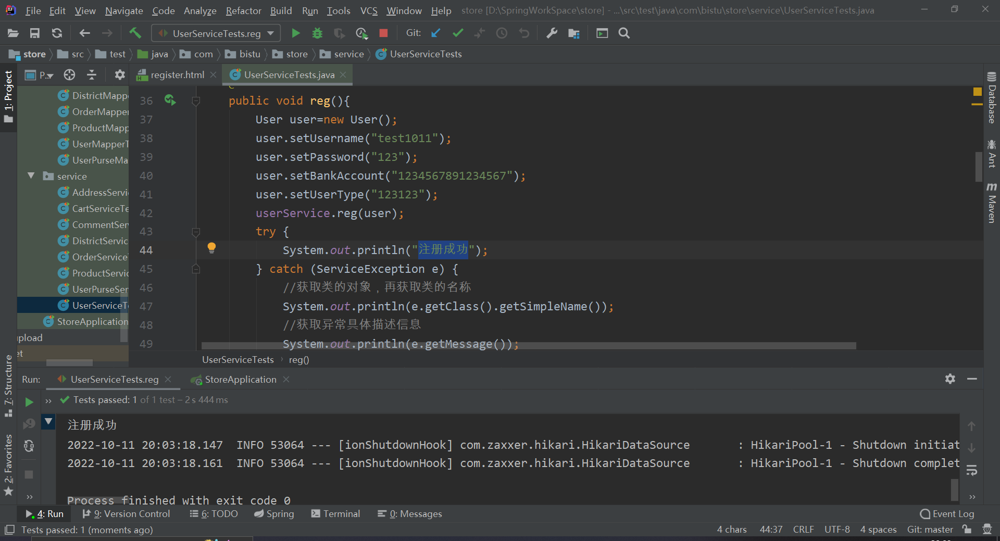  
2. 登录功能  
  
  
    
3. 修改密码功能  
  
    
4. 审核用户注册信息  
  
5. 增加金钱  
  

**测试结论：**  
1. 注册功能正常运行  
2. 登录功能正常运行  
3. 修改密码功能正常运行  
4. 审核用户注册信息正常运行  
5. 增加金钱正常运行  

**实现限制：**  
1.用户注册时手机号为11位  
2.用户注册时邮箱格式应符合邮箱命名规范  
3.用户银行卡应小于19位  

**备注：** 无

### 2.2接口测试
**测试项目名称：**
Controller层接口测试  
**测试人员：**
宋博文  
**测试时间：**
2022/10/11  
**测试内容：**  
Controller层调用Service层实现的接口功能的正确性测试

接口测试内容：
1.地址控制层

**测试环境与系统配置：**
操作系统：Windows7/10  
数据库类型及版本：Navicat 15.0.25-Premium /mysql 5.1.49  
前端服务器：ECMAScript6（JavaScript6）  
后端服务器运行库：  
JRE7以上版本  
SpringBoot v2.6.5  
Tomcat 8.0及以上版本
mybatis 2.2.2 

**测试输入数据：**  
<table>
     <tr>
     <th>测试功能</th>
     <th>输入数据</th>
     <th>预期结果</th>
     </tr>
     <tr>
         <td></td>
         <td></td>
         <td></td>
         </tr>
     <tr>
         <td></td>
         <td></td>
         <td></td>
         </tr>
     <tr>
         <td></td>
         <td></td>
         <td></td>
         </tr>
     <tr>
         <td></td>
         <td></td>
         <td></td>
         </tr>
     <tr>
         <td></td>
         <td></td>
         <td></td>
         </tr>
 </table>

**测试次数：**  
30次

**预期结果：**  
如上表

**测试过程：**  

**测试结果：**  

**测试结论：**  

**实现限制：**  无

**备注：** 无

### 2.3前端测试
**测试项目名称：**
前端测试  
**测试人员：**
宋博文  
**测试时间：**
2022/10/11  
**测试内容：**  
前端登录注册页面测试

1.前端登录功能测试  
2.前端注册功能测试  
3.前端搜索功能测试  

**测试环境与系统配置：**
操作系统：Windows7/10  
数据库类型及版本：Navicat 15.0.25-Premium /mysql 5.1.49  
前端服务器：ECMAScript6（JavaScript6）  
后端服务器运行库：  
JRE7以上版本  
SpringBoot v2.6.5  
Tomcat 8.0及以上版本
mybatis 2.2.2 

**测试输入数据：**  
<table>
     <tr>
     <th>测试功能</th>
     <th>输入数据</th>
     <th>预期结果</th>
     </tr>
     <tr>
         <td>前端注册功能测试</td>
         <td>名字:s1011 密码:123 确认密码:321 手机号:15701651967 邮箱:1123868224@qq.com 性别:1 城市:北京 银行账号:1023041235313314 用户类型:0 </td>
         <td>请输入同样的密码</td>
         </tr>
     <tr>
         <td>前端注册功能测试</td>
         <td>名字:s1011 密码:123 确认密码:123 手机号:157 邮箱:1123868224@qq.com 性别:1 城市:北京 银行账号:1023041235313314 用户类型:0 </td>
         <td>请输入正确的手机号</td>
         </tr>
     <tr>
         <td>前端注册功能测试</td>
         <td>名字:s1011 密码:123 确认密码:321 手机号:15701651967 邮箱:1123q.com 性别:1 城市:北京 银行账号:1023041235313314 用户类型:0 </td>
         <td>请输入有效的E_mail</td>
         </tr>
     <tr>
         <td>前端注册功能测试</td>
         <td>名字:s1011 密码:123 确认密码:321 手机号:15701651967 邮箱:1123868224@qq.com 性别:1 城市:1 银行账号:1023041235313314 用户类型:0 </td>
         <td>请输入正确的城市</td>
         </tr>
     <tr>
         <td>前端注册功能测试</td>
         <td>名字:s1011 密码:123 确认密码:321 手机号:15701651967 邮箱:1123868224@qq.com 性别:1 城市:北京 银行账号:111111111111111111123123 用户类型:0 </td>
         <td>请输入正确的银行卡号</td>
         </tr>
     <tr>
         <td>前端注册功能测试</td>
         <td>名字:s1011 密码:123 确认密码:321 手机号:15701651967 邮箱:1123868224@qq.com 性别:1 城市:北京 银行账号:1023041235313314 用户类型:0 </td>
         <td>注册成功！请等待管理员审核</td>
         </tr>
     <tr>
         <td>前端登录功能测试</td>
         <td>名字：  密码：123   验证码：aaaa  </td>
         <td>请输入姓名</td>
         </tr>
     <tr>
         <td>前端登录功能测试</td>
         <td>名字：s1011  密码：   验证码：aaaa</td>
         <td>请输入密码</td>
         </tr>
     <tr>
         <td>前端登录功能测试</td>
         <td>名字：s1011  密码：   验证码：ad31(aaaa为正确验证码)</td>
         <td>验证码输入错误</td>
         </tr>
     <tr>
         <td>前端登录功能测试</td>
         <td>名字：s1011  密码：123   验证码：aaaa</td>
         <td>用户不存在或未审核，请联系管理员</td>
         </tr>
     <tr>
     <tr>
         <td>前端登录功能测试</td>
         <td>名字：s1011  密码：123   验证码：aaaa</td>
         <td>用户登录成功</td>
         </tr>
     <tr>
     <tr>
         <td>前端登录功能测试</td>
         <td>名字：root  密码：123   验证码：aaaa</td>
         <td>管理员登录成功</td>
         </tr>
     <tr>
     <tr>
         <td>前端登录功能测试</td>
         <td>名字：test2  密码：123   验证码：aaaa</td>
         <td>商家登录成功</td>
         </tr>
     <tr>
         <td>前端搜索功能测试</td>
         <td>aaaa</td>
         <td>搜索内容为空</td>
         </tr>
     <tr>
         <td>前端搜索功能测试</td>
         <td>笔</td>
         <td>显示笔的相关商品</td>
         </tr>
 </table>

**测试次数：**  
14次

**预期结果：**  
如上表

**测试过程：**  
1.前端登录功能测试  

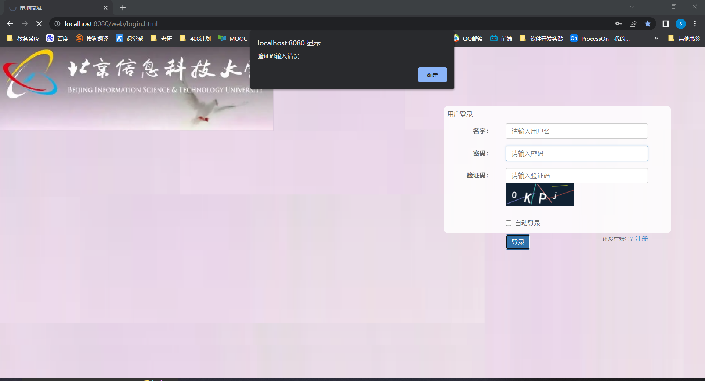
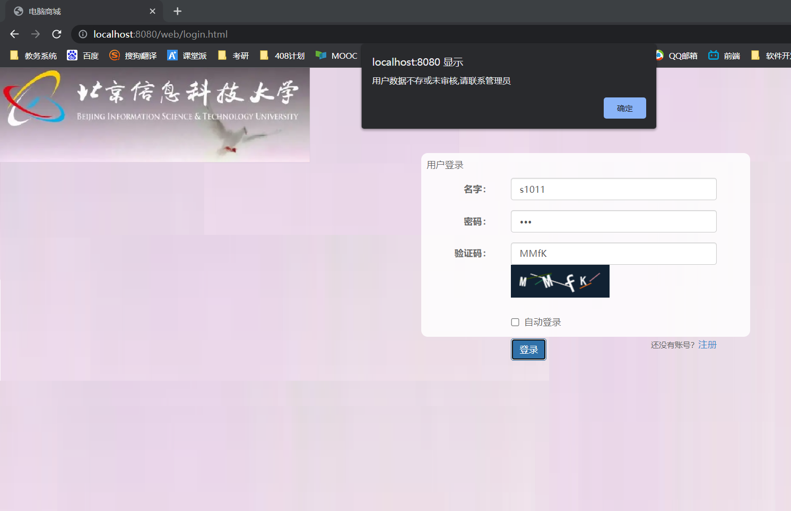
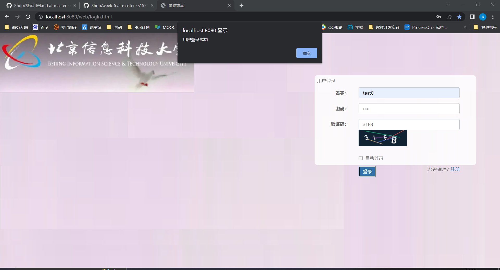

2.前端注册功能测试  
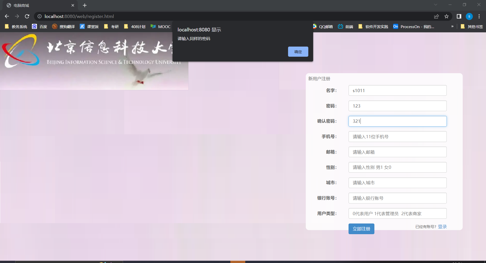

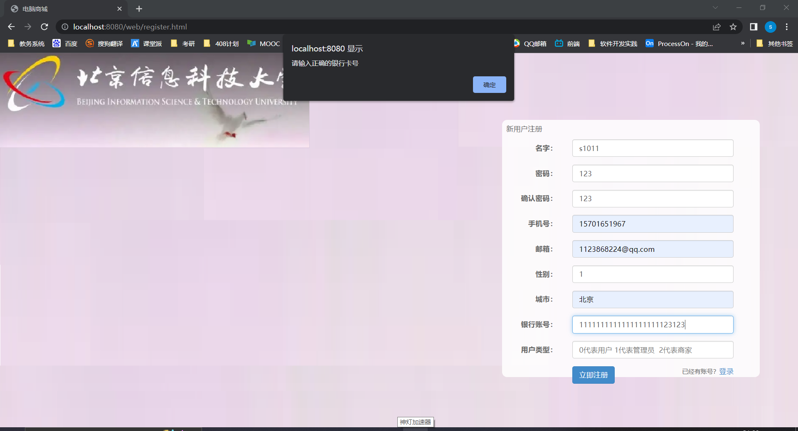
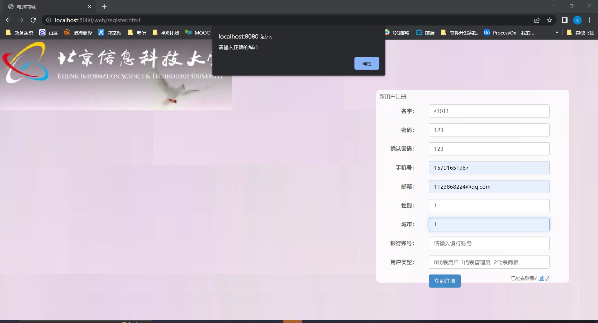
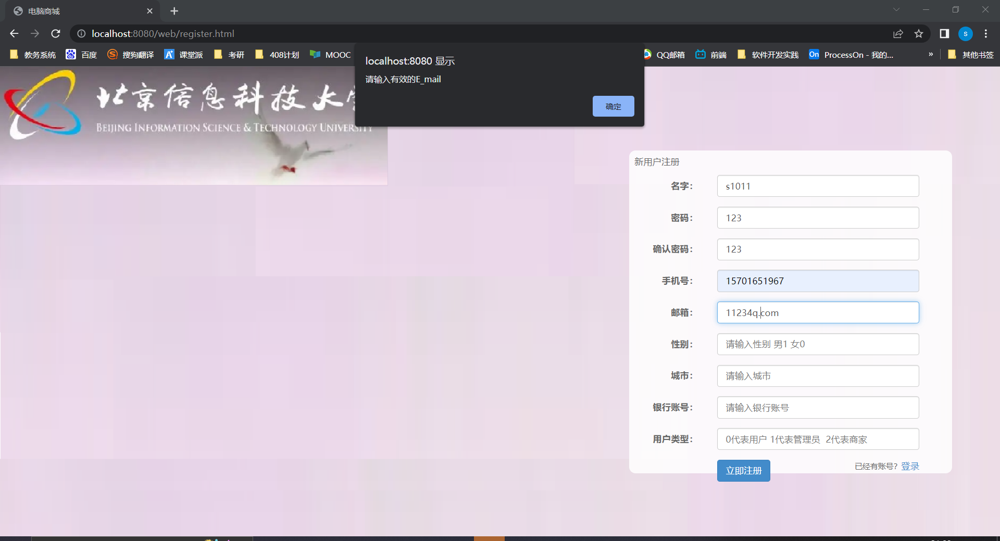
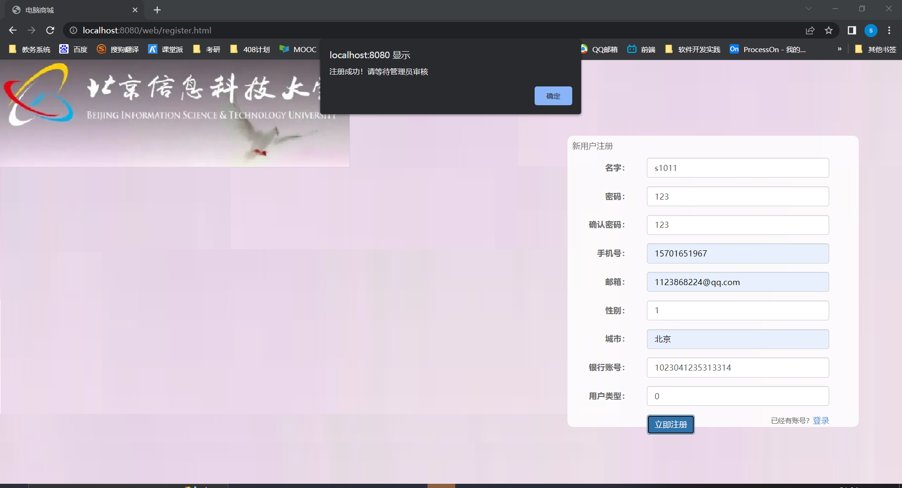

3.前端搜索功能测试 
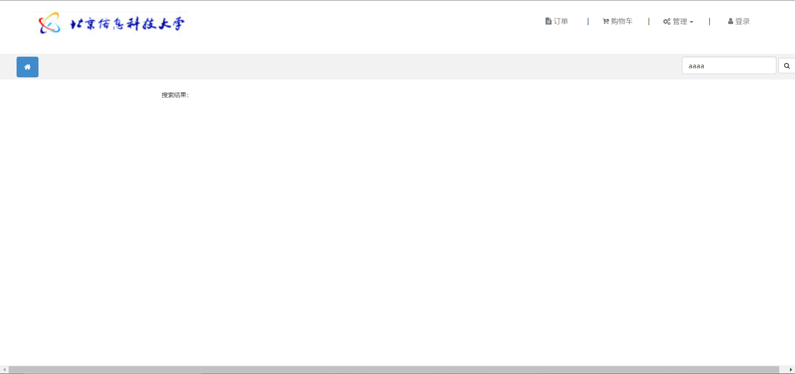
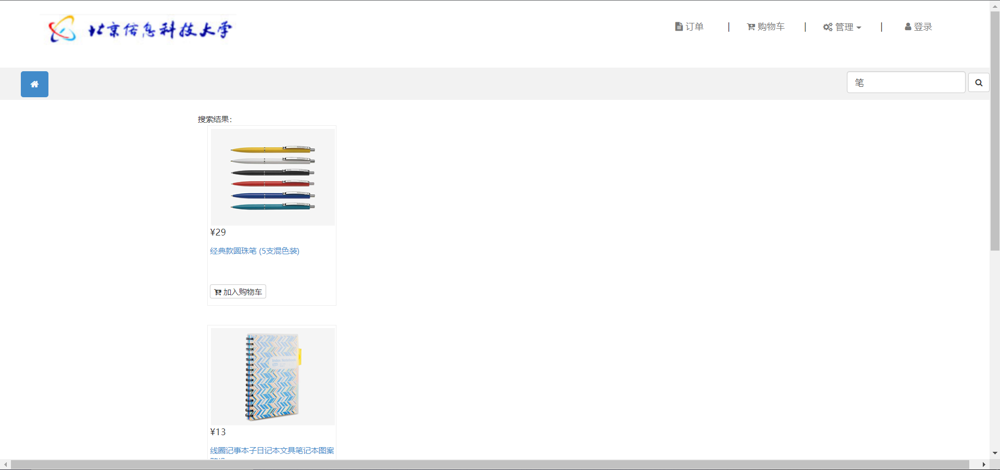

**测试结果：**  
1.前端登录功能测试有相应的反应(参考测试过程)  

2.前端注册功能测试有相应的反应(参考测试过程)     

3.前端搜索功能测试有相应的反应(参考测试过程)    

**测试结论：**  
1.前端登录功能测试正常运行  

2.前端注册功能测试正常运行  

3.前端搜索功能测试正常运行   

**实现限制：**  
1.用户注册时手机号为11位  
2.用户注册时邮箱格式应符合邮箱命名规范  
3.用户银行卡应小于19位  

**备注：** 无